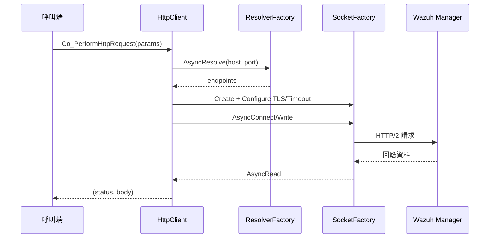
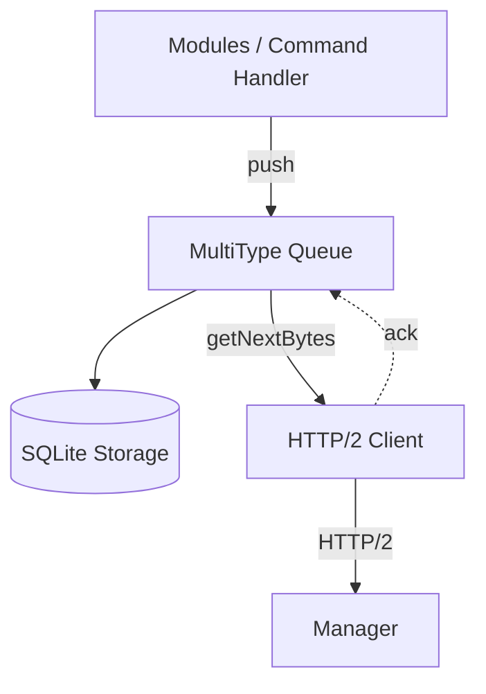
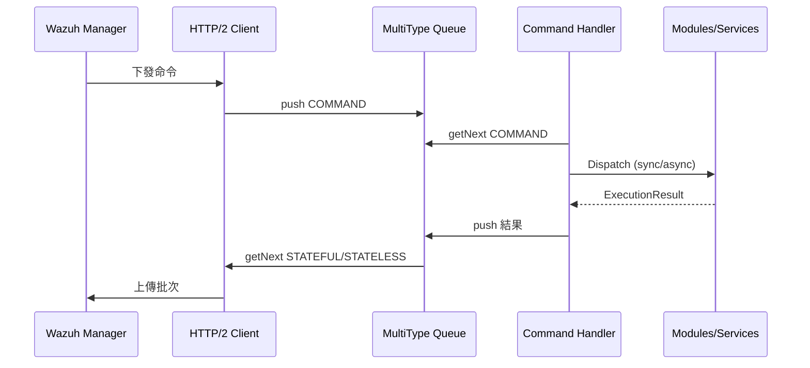
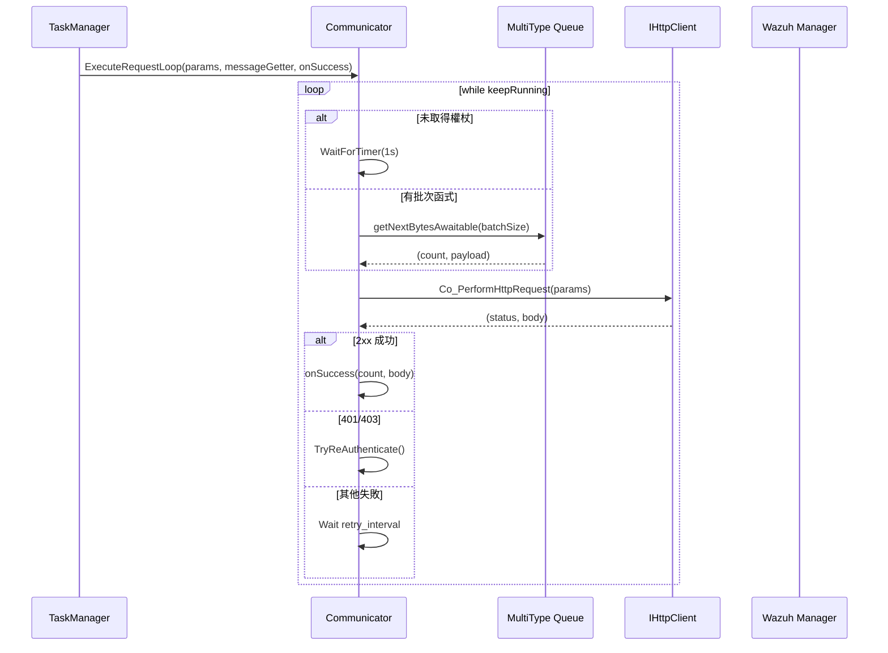

# Wazuh Agent 核心元件實作筆記

本文件聚焦於 HTTP/2 Client、MultiType Queue 與 Command Handler 三個核心元件，說明它們的責任分工、關鍵 API 與彼此之間的資料流。

## 核心概念

- **通訊路徑**：HTTP/2 Client 接收來自 `Agent::Run` 排程的協程請求，向 Manager 取命令並批次上送 Queue 中的事件資料。【F:src/agent/src/agent.cpp†L134-L188】【F:src/agent/http_client/src/http_client.cpp†L81-L181】
- **持久化佇列**：MultiType Queue 透過 SQLite 儲存 STATELESS、STATEFUL 與 COMMAND 三類訊息，為重新啟動與批次傳輸提供緩衝。【F:src/agent/multitype_queue/include/multitype_queue.hpp†L25-L123】【F:src/agent/multitype_queue/src/multitype_queue.cpp†L17-L224】
- **命令協調**：Command Handler 驗證命令格式、維護執行狀態並呼叫相對應的模組或系統處理程序。【F:src/agent/command_handler/src/command_handler.cpp†L37-L142】

## 元件摘要

| 元件 | 角色 | 重要資料結構 |
| --- | --- | --- |
| HTTP/2 Client | 提供同步/協程 HTTP 請求 API，負責解析主機、建立 TLS 連線與錯誤回復 | `HttpRequestParams`、`IHttpClient`【F:src/agent/http_client/include/http_request_params.hpp†L17-L65】【F:src/agent/http_client/include/ihttp_client.hpp†L13-L33】 |
| MultiType Queue | 封裝基於 SQLite 的多型佇列，支援推送、批次擷取與背壓控制 | `Message`、`MultiTypeQueue`【F:src/agent/multitype_queue/include/message_entry/message.hpp†L7-L46】【F:src/agent/multitype_queue/include/multitype_queue.hpp†L25-L124】 |
| Command Handler | 管理命令生命週期、持久化結果並在同步或非同步模式下分派命令 | `CommandHandler`、`VALID_COMMANDS_MAP`【F:src/agent/command_handler/src/command_handler.cpp†L20-L142】 |

## HTTP/2 Client

### 職責

1. **組裝請求**：依 `HttpRequestParams` 產生標頭、權杖或 Basic 認證資料，必要時設定 JSON 本文與 chunked 傳輸。【F:src/agent/http_client/src/http_client.cpp†L32-L68】
2. **建立連線**：透過 Resolver/Socket 工廠解析主機、設定 TLS 驗證與逾時，再以非同步或同步模式寫入與讀取資料。【F:src/agent/http_client/src/http_client.cpp†L103-L170】【F:src/agent/http_client/src/http_client.cpp†L183-L234】
3. **錯誤控管**：捕捉連線與讀寫例外，統一回傳 500 狀態碼並寫入詳細日誌，避免將例外拋回呼叫端。【F:src/agent/http_client/src/http_client.cpp†L171-L180】

### 協程流程

## MultiType Queue

### 儲存模型

- 依 MessageType 映射至 `STATELESS`、`STATEFUL`、`COMMAND` 三張 SQLite 資料表，透過 `m_mapMessageTypeName` 取得對應表名。【F:src/agent/multitype_queue/include/multitype_queue.hpp†L32-L38】
- Message 物件除 JSON 本文外還包含模組名稱、類型與 metadata，方便 Command Handler 與模組區分來源。【F:src/agent/multitype_queue/include/message_entry/message.hpp†L15-L46】

### 操作重點

1. **推送**：`push` 會檢查佇列容量，必要時使用條件變數或協程定時器等待空間，再寫入 SQLite 並喚醒等待中的讀者。【F:src/agent/multitype_queue/src/multitype_queue.cpp†L53-L155】
2. **批次取得**：`getNextBytesAwaitable` 依批次門檻或逾時回傳資料，同時記錄是否滿足預期大小以利日誌追蹤。【F:src/agent/multitype_queue/src/multitype_queue.cpp†L188-L224】
3. **同步支援**：提供同步版 `getNext`、`pop` 與 `push(std::vector<Message>)`，方便非協程模組重用。【F:src/agent/multitype_queue/src/multitype_queue.cpp†L157-L333】

### 批次傳輸示意

## Command Handler

### 核心流程

1. **啟動時清理**：代理重新啟動後，會掃描資料庫中仍為 `IN_PROGRESS` 的命令並更新狀態，避免重複執行。【F:src/agent/command_handler/src/command_handler.cpp†L79-L170】
2. **命令驗證**：`CheckCommand` 依 `VALID_COMMANDS_MAP` 核對目標模組、執行模式與必要參數；不符合者立即回報失敗並自 Queue 移除。【F:src/agent/command_handler/src/command_handler.cpp†L20-L121】【F:src/agent/command_handler/src/command_handler.cpp†L172-L200】
3. **執行與回報**：同步命令會直接等待結果；非同步命令以 `co_spawn` 啟動協程，完成後更新 Command Store 並透過回呼回寫 Queue。【F:src/agent/command_handler/src/command_handler.cpp†L121-L141】

### 與其他元件的互動

## 整體協同

當 Agent 啟動時，Task Manager 會同時排程 HTTP/2 通訊、Queue 批次傳輸與命令處理協程；MultiType Queue 則作為資料交會點，確保模組推送的事件與命令回報在 Agent 重啟或網路不穩定時不會遺失。【F:src/agent/src/agent.cpp†L134-L196】【F:src/agent/multitype_queue/src/multitype_queue.cpp†L17-L224】

## Communicator

`communicator::Communicator` 將認證、事件上送、命令抓取與集中化設定下載的 HTTP 工作拆分成四條協程，並在 `Agent::Run` 時由 Task Manager 依固定順序排程：

1. **同步登入**：`SendAuthenticationRequest` 立即以 UUID/Key 呼叫 `/api/v1/authentication`，若成功將 JWT 寫入 `m_token` 並記錄過期時間供後續協程使用。【F:src/agent/src/agent.cpp†L137-L142】【F:src/agent/communicator/src/communicator.cpp†L74-L135】
2. **權杖續期**：`WaitForTokenExpirationAndAuthenticate` 先等到當前權杖剩餘壽命減去 2 秒 (`TOKEN_PRE_EXPIRY_SECS`) 後再觸發重新認證；若登入失敗或遇到例外，會依 `agent.retry_interval` 重試，直到成功或 Agent 停止。【F:src/agent/src/agent.cpp†L144-L146】【F:src/agent/communicator/src/communicator.cpp†L137-L210】
3. **命令抓取**：`GetCommandsFromManager` 以 `commands_request_timeout` 參數 (預設 15 分鐘上限、10 秒下限) 呼叫 `/api/v1/commands`，取回的 JSON 透過 `PushCommandsToQueue` 轉成 COMMAND 訊息寫入 MultiType Queue。【F:src/agent/src/agent.cpp†L148-L156】【F:src/agent/communicator/src/communicator.cpp†L212-L229】【F:src/agent/src/message_queue_utils.cpp†L27-L47】
4. **事件上送**：`StatefulMessageProcessingTask` 與 `StatelessMessageProcessingTask` 會傳入 `GetMessagesFromQueue` 協程，依 `events.batch_size` 批次取出 STATEFUL/STATELESS 訊息並分別送往 `/api/v1/events/stateful` 與 `/api/v1/events/stateless`。【F:src/agent/src/agent.cpp†L158-L180】【F:src/agent/communicator/src/communicator.cpp†L231-L276】【F:src/agent/src/message_queue_utils.cpp†L7-L25】

上述三個長駐協程都共用 `ExecuteRequestLoop`，流程如下：

### 設定來源與逾時

| 項目 | 設定鍵 | 預設值/範圍 | 用途 |
| --- | --- | --- | --- |
| Server URL | `agent.server_url` | `config::agent::DEFAULT_SERVER_URL` | 所有 REST 呼叫的 base URL。【F:src/agent/communicator/src/communicator.cpp†L49-L67】 |
| Retry Interval | `agent.retry_interval` | `config::agent::DEFAULT_RETRY_INTERVAL` (毫秒) | 認證失敗與事件/命令錯誤的回復延遲。【F:src/agent/communicator/src/communicator.cpp†L69-L73】【F:src/agent/communicator/src/communicator.cpp†L302-L320】 |
| Batch Size | `events.batch_size` | 1,000–100,000,000 bytes | `GetMessagesFromQueue` 批次閾值，控制每次上傳的 payload 大小。【F:src/agent/communicator/src/communicator.cpp†L75-L86】【F:src/agent/src/message_queue_utils.cpp†L7-L25】 |
| Command Timeout | `agent.commands_request_timeout` | 10 秒–15 分鐘 (毫秒) | `/api/v1/commands` 請求的 HTTP 逾時參數。【F:src/agent/communicator/src/communicator.cpp†L88-L106】【F:src/agent/communicator/src/communicator.cpp†L212-L229】 |
| Verification Mode | `agent.verification_mode` | 見 `config::agent::VALID_VERIFICATION_MODES` | 決定 TLS 憑證驗證策略。【F:src/agent/communicator/src/communicator.cpp†L88-L101】 |

### 回呼與資料管線

- **命令入佇列**：成功回應後呼叫 `PushCommandsToQueue`，後者解析 JSON 並將每筆命令轉成 COMMAND 類型訊息推入 MultiType Queue，供 Command Handler 後續處理。【F:src/agent/src/agent.cpp†L148-L156】【F:src/agent/src/message_queue_utils.cpp†L27-L47】
- **事件清除**：事件上送成功時以 `PopMessagesFromQueue` 依回報的筆數自 Queue 刪除資料，避免重複送出。【F:src/agent/src/agent.cpp†L158-L180】【F:src/agent/src/message_queue_utils.cpp†L23-L26】
- **集中化設定下載**：`GetGroupConfigurationFromManager` 以帶權杖的 GET `/api/v1/files?file_name=<group>.yml` 取得共享檔案，成功後寫入指定路徑；若收到 401/403 會觸發 `TryReAuthenticate` 以便權杖更新。此協程由 `CentralizedConfiguration::ExecuteCommand` 呼叫，在命令執行流程中與 Communicator 解耦。【F:src/agent/communicator/src/communicator.cpp†L278-L319】【F:src/agent/src/agent.cpp†L57-L86】【F:src/agent/centralized_configuration/include/centralized_configuration.hpp†L17-L54】

### 重試與錯誤處理

- **認證失敗**：登入失敗時記錄警告並等待 `retry_interval` 後重試；解析 JWT 失敗會清空權杖並立即進入重試循環。【F:src/agent/communicator/src/communicator.cpp†L108-L135】
- **HTTP 回應**：`ExecuteRequestLoop` 對於非逾時的失敗 (例如 5xx) 會按 `retry_interval` 休眠後重試；收到 401/403 則取消權杖定時器，讓認證協程提前刷新憑證。【F:src/agent/communicator/src/communicator.cpp†L302-L320】
- **權杖輪詢**：若 `m_token` 為空，所有傳輸協程都會每秒輪詢一次等待認證完成，避免在沒有權杖時打 API。【F:src/agent/communicator/src/communicator.cpp†L286-L304】

### 重構建議與可抽換介面

- **HTTP Client 抽象**：目前直接依賴 `http_client::IHttpClient`，仍與具體設定 (驗證模式、逾時) 緊耦合；可引入策略介面封裝重試與逾時，方便替換實作 (REST/gRPC)。【F:src/agent/communicator/src/communicator.cpp†L40-L107】【F:src/agent/communicator/src/communicator.cpp†L231-L320】
- **Token 儲存與刷新**：權杖與到期時間以共享字串與原始型別存放，並由 Communicator 直接控制；建議抽出 TokenProvider 介面，提供快取、持久化或多租戶的替代方案。【F:src/agent/communicator/src/communicator.cpp†L52-L135】【F:src/agent/communicator/src/communicator.cpp†L137-L210】
- **設定解析耦合**：Communicator 直接查詢 `ConfigurationParser` 取出設定，未提供覆寫入口；可將設定依賴改為 `CommunicatorConfig` 結構，以便測試或動態調整批次參數。【F:src/agent/communicator/src/communicator.cpp†L49-L107】

