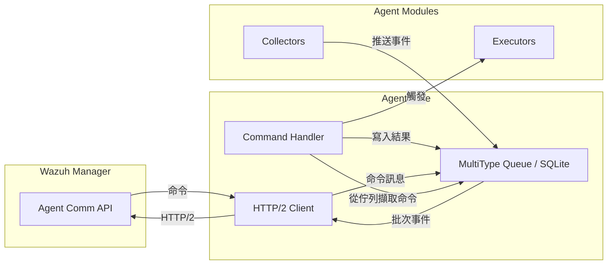
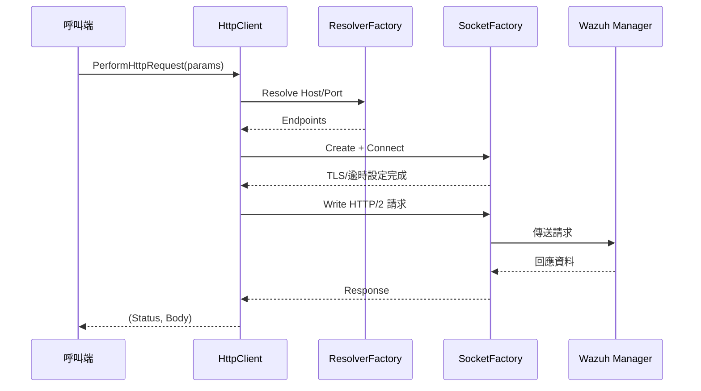
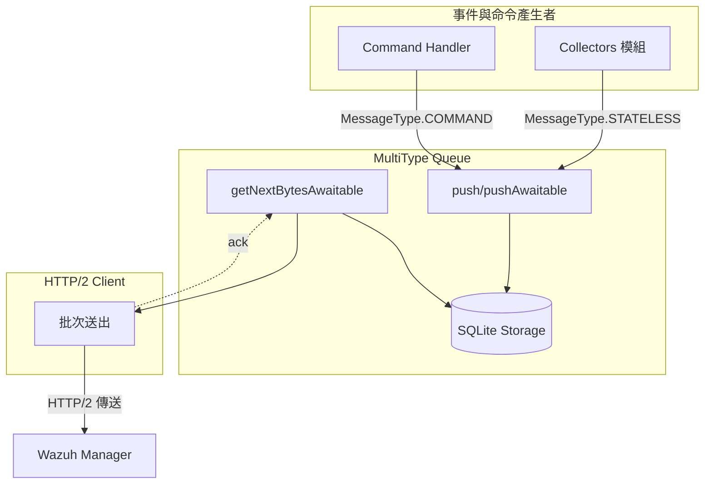
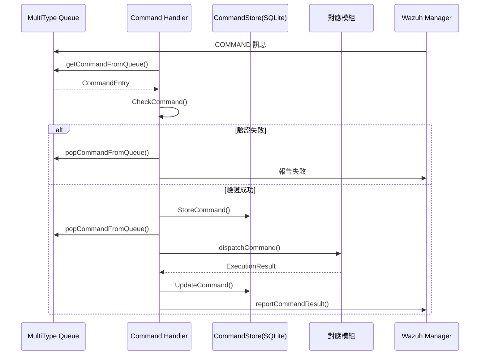
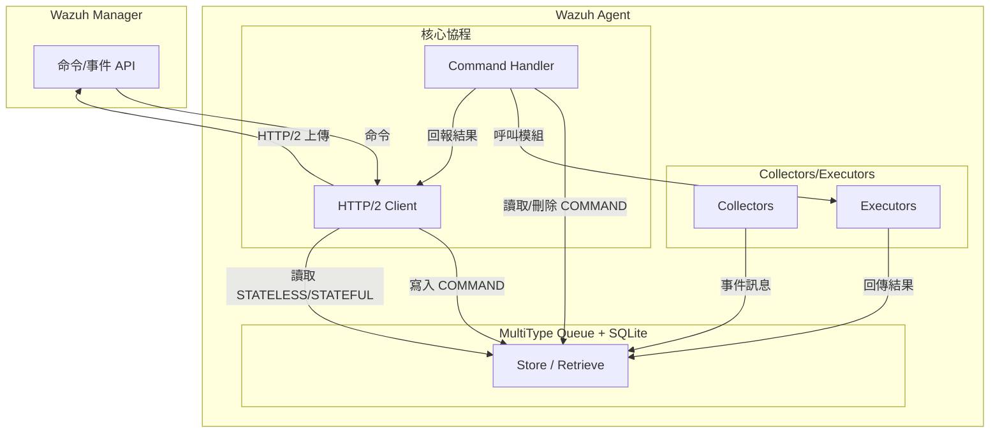

# Wazuh Agent 核心元件深度解析

## 線上互動架構概觀

Wazuh Agent 的核心由 HTTP/2 Client、MultiType Queue 與 Command Handler 共同組成，負責在本地模組與遠端 Wazuh Manager 之間維持可靠的資料交換。Client 透過 HTTP/2 與 Manager 建立持續連線並支援授權、逾時與錯誤處理；Queue 以 SQLite 為後端提供事件與命令的持久化佇列；Command Handler 則將 Manager 下發的命令序列化處理，並回報執行結果。這些元件協同運作的高階視圖如下：

上圖與官方架構文件描述一致，強調核心元件透過 Queue 交換資料與指令，並仰賴 HTTP/2 連線與 SQLite 儲存維持可靠性。【F:docs/ref/introduction/architecture.md†L3-L77】

## HTTP/2 Client

### 核心責任

* 建立解析器與 socket 實體，支援同步／非同步 HTTP/2 請求流程，確保與 Manager 的連線完整性。【F:src/agent/http_client/src/http_client.cpp†L81-L140】
* 根據 `HttpRequestParams` 產生請求標頭，處理 Token 或 Basic 認證與 JSON 請求本文，支援內容類型與 chunked 傳輸設定。【F:src/agent/http_client/src/http_client.cpp†L32-L67】
* 於非同步流程中設定 TLS 驗證與逾時策略，對錯誤進行例外處理並寫入日誌，回傳標準化的 `(status, body)` 結構。【F:src/agent/http_client/src/http_client.cpp†L127-L180】

`HttpRequestParams` 封裝了 HTTP 方法、伺服器資訊、驗證模式、使用者代理字串以及逾時設定，提供 Client 在建構請求時使用。【F:src/agent/http_client/include/http_request_params.hpp†L17-L60】Client 實作介面 `IHttpClient` 的同步與協程版本，讓呼叫端可在不同執行緒模型下重用同一流程。【F:src/agent/http_client/include/ihttp_client.hpp†L13-L33】

### 流程

非同步版本透過 `co_await` 與 Boost.Asio 定時器管理連線流程，同時於例外情境下統一回傳 500 狀態碼與錯誤訊息，避免呼叫端需要處理未預期的例外。【F:src/agent/http_client/src/http_client.cpp†L103-L180】

## MultiType Queue

### 核心責任

* 針對 STATELESS、STATEFUL 與 COMMAND 三種訊息類型使用獨立表格，並限制每個類型的最大佇列長度以避免記憶體爆滿。【F:src/agent/multitype_queue/include/multitype_queue.hpp†L24-L44】【F:src/agent/multitype_queue/src/multitype_queue.cpp†L53-L105】
* 透過 SQLite 持久化儲存，提供同步與協程版本的 `push`、`getNext`、`getNextBytes`、`pop` 操作，確保事件與命令在 Agent 重啟後仍可復原。【F:src/agent/multitype_queue/src/multitype_queue.cpp†L107-L224】【F:src/agent/multitype_queue/src/multitype_queue.cpp†L226-L333】
* 使用條件變數與定時器控制批次大小與逾時，達成批次傳輸與背壓管理，並在達到批次門檻或逾時時傳回累積訊息。【F:src/agent/multitype_queue/src/multitype_queue.cpp†L188-L224】

Queue 依賴 `Storage` 類別對 SQLite 進行 CRUD，並透過 `ConfigurationParser` 取得批次間隔、佇列大小與資料路徑設定。【F:src/agent/multitype_queue/src/multitype_queue.cpp†L17-L48】【F:src/agent/multitype_queue/src/storage.hpp†L12-L55】訊息封裝在 `Message` 類別中，包含類型、模組名稱、模組類型與額外中繼資料。【F:src/agent/multitype_queue/include/message_entry/message.hpp†L7-L46】

### 批次與持久化流程

此設計確保：

1. 任何推送操作都會在 SQLite 中持久化，並在成功後喚醒等待的生產者或消費者。【F:src/agent/multitype_queue/src/multitype_queue.cpp†L61-L105】
2. 消費端可依照所需 byte 數量或逾時取得批次資料，減少頻繁請求並提升傳輸效率。【F:src/agent/multitype_queue/src/multitype_queue.cpp†L188-L224】
3. 透過 `isEmpty`、`isFull` 等查詢方法，Client 與 Command Handler 可以動態評估佇列狀態以調整處理節奏。【F:src/agent/multitype_queue/src/multitype_queue.cpp†L282-L333】

## Command Handler

### 核心責任

* 管理從 Queue 取出的命令，驗證參數與對應模組，並將命令落地到 SQLite 型的 `CommandStore` 以追蹤狀態。【F:src/agent/command_handler/src/command_handler.cpp†L67-L125】【F:src/agent/command_handler/src/command_store.hpp†L12-L52】
* 支援同步與非同步命令；同步命令直接等待執行結果，非同步命令則透過 `co_spawn` 派生協程執行，避免阻塞命令流程。【F:src/agent/command_handler/src/command_handler.cpp†L121-L141】
* 在啟動時清理未完成的命令，並於 Agent 停止時停止主循環，確保命令狀態與 Manager 保持一致。【F:src/agent/command_handler/src/command_handler.cpp†L79-L170】【F:src/agent/command_handler/src/command_handler.cpp†L209-L211】

命令定義使用 `CommandEntry` 封裝命令識別、模組、參數、執行模式與結果狀態，並透過常數定義受支援的命令與模組名稱。【F:src/agent/command_handler/include/command_entry/command_entry.hpp†L9-L110】`CheckCommand` 會依據允許命令清單驗證參數型別與額外欄位，避免執行未授權操作。【F:src/agent/command_handler/src/command_handler.cpp†L172-L205】

### 命令處理流程

若 Agent 在命令執行期間重啟，Command Handler 會於啟動時將狀態為 `IN_PROGRESS` 的命令更新成失敗或成功（針對 restart 命令），並同步回報，避免命令永遠卡住。【F:src/agent/command_handler/src/command_handler.cpp†L145-L170】

## 整體資料流摘要

此資料流展示：

1. 事件先進入 MultiType Queue，再由 Client 批次傳送至 Manager，確保傳輸時序與可靠性。【F:src/agent/multitype_queue/src/multitype_queue.cpp†L226-L248】
2. Manager 下發命令後由 Client 轉寫至 Queue，Command Handler 負責擷取與執行，並透過 CommandStore 追蹤狀態。【F:src/agent/command_handler/src/command_handler.cpp†L67-L141】
3. 所有命令與事件皆在 SQLite 中持久化，支援 Agent 重啟後的恢復能力，符合官方架構文件對可靠傳輸的要求。【F:src/agent/multitype_queue/src/storage.hpp†L12-L55】【F:docs/ref/introduction/architecture.md†L63-L77】
