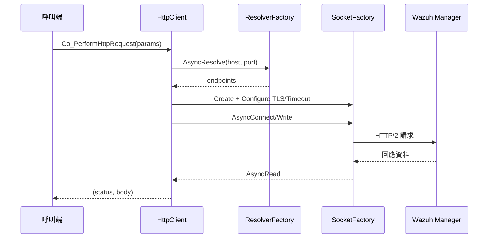
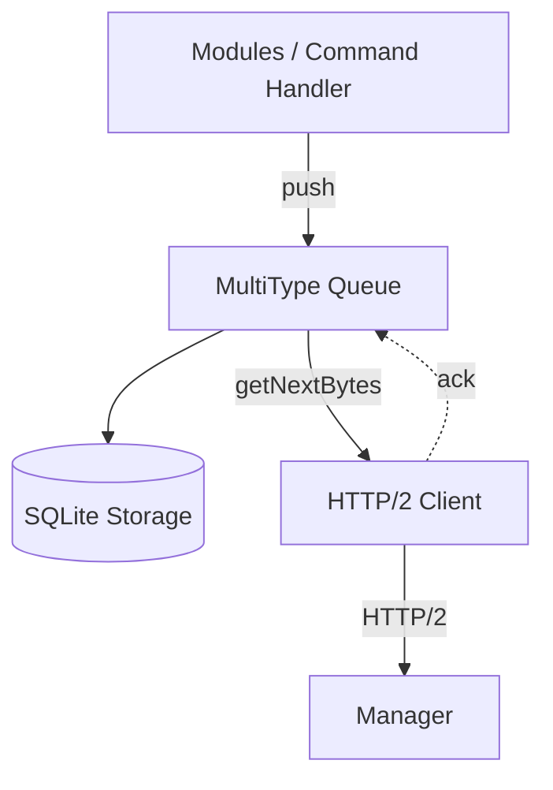
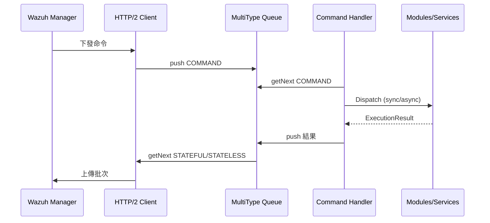

# Wazuh Agent 核心元件實作筆記

本文件聚焦於 HTTP/2 Client、MultiType Queue 與 Command Handler 三個核心元件，說明它們的責任分工、關鍵 API 與彼此之間的資料流。

## 核心概念

- **通訊路徑**：HTTP/2 Client 接收來自 `Agent::Run` 排程的協程請求，向 Manager 取命令並批次上送 Queue 中的事件資料。【F:src/agent/src/agent.cpp†L134-L188】【F:src/agent/http_client/src/http_client.cpp†L81-L181】
- **持久化佇列**：MultiType Queue 透過 SQLite 儲存 STATELESS、STATEFUL 與 COMMAND 三類訊息，為重新啟動與批次傳輸提供緩衝。【F:src/agent/multitype_queue/include/multitype_queue.hpp†L25-L123】【F:src/agent/multitype_queue/src/multitype_queue.cpp†L17-L224】
- **命令協調**：Command Handler 驗證命令格式、維護執行狀態並呼叫相對應的模組或系統處理程序。【F:src/agent/command_handler/src/command_handler.cpp†L37-L142】

## 元件摘要

| 元件 | 角色 | 重要資料結構 |
| --- | --- | --- |
| HTTP/2 Client | 提供同步/協程 HTTP 請求 API，負責解析主機、建立 TLS 連線與錯誤回復 | `HttpRequestParams`、`IHttpClient`【F:src/agent/http_client/include/http_request_params.hpp†L17-L65】【F:src/agent/http_client/include/ihttp_client.hpp†L13-L33】 |
| MultiType Queue | 封裝基於 SQLite 的多型佇列，支援推送、批次擷取與背壓控制 | `Message`、`MultiTypeQueue`【F:src/agent/multitype_queue/include/message_entry/message.hpp†L7-L46】【F:src/agent/multitype_queue/include/multitype_queue.hpp†L25-L124】 |
| Command Handler | 管理命令生命週期、持久化結果並在同步或非同步模式下分派命令 | `CommandHandler`、`VALID_COMMANDS_MAP`【F:src/agent/command_handler/src/command_handler.cpp†L20-L142】 |

## HTTP/2 Client

### 職責

1. **組裝請求**：依 `HttpRequestParams` 產生標頭、權杖或 Basic 認證資料，必要時設定 JSON 本文與 chunked 傳輸。【F:src/agent/http_client/src/http_client.cpp†L32-L68】
2. **建立連線**：透過 Resolver/Socket 工廠解析主機、設定 TLS 驗證與逾時，再以非同步或同步模式寫入與讀取資料。【F:src/agent/http_client/src/http_client.cpp†L103-L170】【F:src/agent/http_client/src/http_client.cpp†L183-L234】
3. **錯誤控管**：捕捉連線與讀寫例外，統一回傳 500 狀態碼並寫入詳細日誌，避免將例外拋回呼叫端。【F:src/agent/http_client/src/http_client.cpp†L171-L180】

### 協程流程

## MultiType Queue

### 儲存模型

- 依 MessageType 映射至 `STATELESS`、`STATEFUL`、`COMMAND` 三張 SQLite 資料表，透過 `m_mapMessageTypeName` 取得對應表名。【F:src/agent/multitype_queue/include/multitype_queue.hpp†L32-L38】
- Message 物件除 JSON 本文外還包含模組名稱、類型與 metadata，方便 Command Handler 與模組區分來源。【F:src/agent/multitype_queue/include/message_entry/message.hpp†L15-L46】

### 操作重點

1. **推送**：`push` 會檢查佇列容量，必要時使用條件變數或協程定時器等待空間，再寫入 SQLite 並喚醒等待中的讀者。【F:src/agent/multitype_queue/src/multitype_queue.cpp†L53-L155】
2. **批次取得**：`getNextBytesAwaitable` 依批次門檻或逾時回傳資料，同時記錄是否滿足預期大小以利日誌追蹤。【F:src/agent/multitype_queue/src/multitype_queue.cpp†L188-L224】
3. **同步支援**：提供同步版 `getNext`、`pop` 與 `push(std::vector<Message>)`，方便非協程模組重用。【F:src/agent/multitype_queue/src/multitype_queue.cpp†L157-L333】

### 批次傳輸示意

## Command Handler

### 核心流程

1. **啟動時清理**：代理重新啟動後，會掃描資料庫中仍為 `IN_PROGRESS` 的命令並更新狀態，避免重複執行。【F:src/agent/command_handler/src/command_handler.cpp†L79-L170】
2. **命令驗證**：`CheckCommand` 依 `VALID_COMMANDS_MAP` 核對目標模組、執行模式與必要參數；不符合者立即回報失敗並自 Queue 移除。【F:src/agent/command_handler/src/command_handler.cpp†L20-L121】【F:src/agent/command_handler/src/command_handler.cpp†L172-L200】
3. **執行與回報**：同步命令會直接等待結果；非同步命令以 `co_spawn` 啟動協程，完成後更新 Command Store 並透過回呼回寫 Queue。【F:src/agent/command_handler/src/command_handler.cpp†L121-L141】

### 與其他元件的互動

## 整體協同

當 Agent 啟動時，Task Manager 會同時排程 HTTP/2 通訊、Queue 批次傳輸與命令處理協程；MultiType Queue 則作為資料交會點，確保模組推送的事件與命令回報在 Agent 重啟或網路不穩定時不會遺失。【F:src/agent/src/agent.cpp†L134-L196】【F:src/agent/multitype_queue/src/multitype_queue.cpp†L17-L224】

