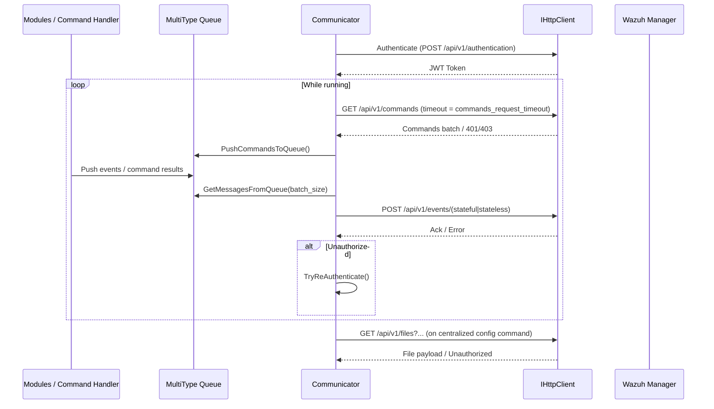
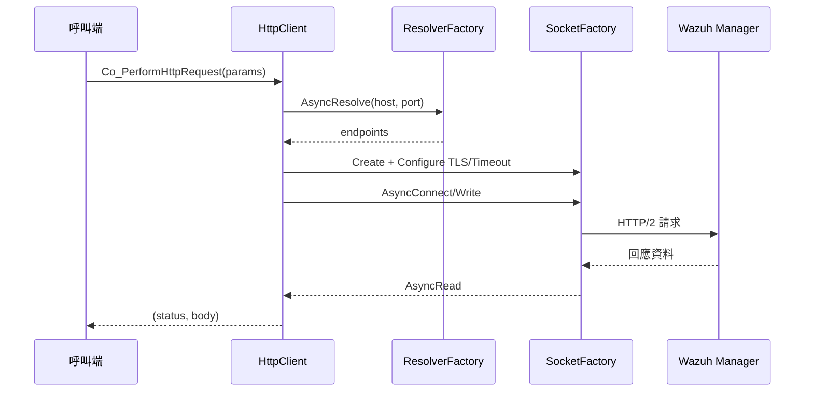
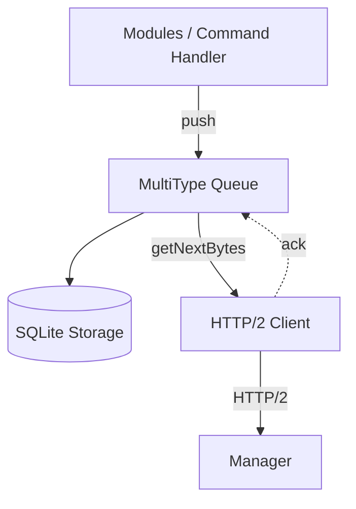
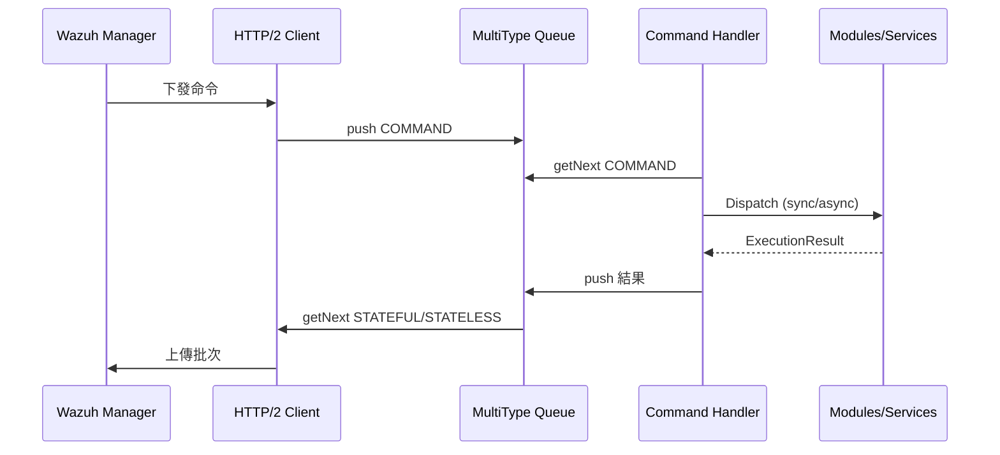

# Wazuh Agent 核心元件實作筆記

本文件聚焦於 HTTP/2 Client、Communicator、MultiType Queue 與 Command Handler 等核心元件，說明它們的責任分工、關鍵 API 與彼此之間的資料流。

## 核心概念

- **通訊路徑**：Agent 啟動後會先由 Communicator 排程認證、命令抓取與事件批次上傳，再呼叫 HTTP/2 Client 執行請求，確保與 Manager 之間的資料交換不中斷。【F:src/agent/src/agent.cpp†L134-L206】【F:src/agent/communicator/src/communicator.cpp†L102-L421】【F:src/agent/http_client/src/http_client.cpp†L81-L181】
- **持久化佇列**：MultiType Queue 透過 SQLite 儲存 STATELESS、STATEFUL 與 COMMAND 三類訊息，為重新啟動與批次傳輸提供緩衝。【F:src/agent/multitype_queue/include/multitype_queue.hpp†L25-L123】【F:src/agent/multitype_queue/src/multitype_queue.cpp†L17-L224】
- **命令協調**：Command Handler 驗證命令格式、維護執行狀態並呼叫相對應的模組或系統處理程序。【F:src/agent/command_handler/src/command_handler.cpp†L37-L142】

## 元件摘要

| 元件 | 角色 | 重要資料結構 |
| --- | --- | --- |
| HTTP/2 Client | 提供同步/協程 HTTP 請求 API，負責解析主機、建立 TLS 連線與錯誤回復 | `HttpRequestParams`、`IHttpClient`【F:src/agent/http_client/include/http_request_params.hpp†L17-L65】【F:src/agent/http_client/include/ihttp_client.hpp†L13-L33】 |
| Communicator | 管理存取權杖、排程所有對 Manager 的協程請求與重試策略 | `Communicator`【F:src/agent/communicator/src/communicator.cpp†L102-L421】 |
| MultiType Queue | 封裝基於 SQLite 的多型佇列，支援推送、批次擷取與背壓控制 | `Message`、`MultiTypeQueue`【F:src/agent/multitype_queue/include/message_entry/message.hpp†L7-L46】【F:src/agent/multitype_queue/include/multitype_queue.hpp†L25-L124】 |
| Command Handler | 管理命令生命週期、持久化結果並在同步或非同步模式下分派命令 | `CommandHandler`、`VALID_COMMANDS_MAP`【F:src/agent/command_handler/src/command_handler.cpp†L20-L142】 |

## Communicator

### 協程排程與重試邏輯

Agent 啟動後會同步呼叫 `SendAuthenticationRequest` 以確認 enrollment 狀態，隨後將以下協程排入 Task Manager，由 Communicator 與 Boost.Asio 管理生命週期：【F:src/agent/src/agent.cpp†L134-L206】【F:src/agent/communicator/src/communicator.cpp†L102-L352】

| 協程 | 目的 | 核心流程與重試條件 |
| --- | --- | --- |
| `WaitForTokenExpirationAndAuthenticate` | 維持 JWT 權杖有效 | 先等待既有權杖的 `exp` 倒數，再呼叫 `SendAuthenticationRequest`。失敗或例外時以 `retry_interval`（預設 1 秒）回退，成功後排程下一次於過期前 2 秒再更新權杖。若其他協程偵測 401/403 會呼叫 `TryReAuthenticate` 取消定時器，強制重新取 token。【F:src/agent/communicator/src/communicator.cpp†L102-L253】【F:src/agent/communicator/src/communicator.cpp†L295-L305】 |
| `GetCommandsFromManager` | 抓取待執行命令 | 以 GET `/api/v1/commands` 搭配 `commands_request_timeout` 等待伺服端推播。401/403 會觸發重新認證，非逾時錯誤改用 `retry_interval`（`agent.retry_interval`）退避再試。【F:src/agent/communicator/src/communicator.cpp†L256-L421】 |
| `StatefulMessageProcessingTask` / `StatelessMessageProcessingTask` | 批次上傳事件 | 先透過 `message_queue_utils::GetMessagesFromQueue` 以 `events.batch_size` 批次取得 Queue 內容，再以 POST `/api/v1/events/stateful` 或 `/api/v1/events/stateless` 上傳。成功時由 `onSuccess` 回呼刪除同批訊息；失敗時 401/403 會要求重新認證，其他錯誤以 `retry_interval` 退避。【F:src/agent/src/agent.cpp†L147-L169】【F:src/agent/src/message_queue_utils.cpp†L6-L32】【F:src/agent/communicator/src/communicator.cpp†L271-L421】 |
| `CommandsProcessingTask`（Command Handler） | 執行命令並回報 | 雖由 Command Handler 實作，但其工作流程依賴 Communicator 抓取命令與重試策略。Command Handler 取出命令後會將結果寫回 Queue，由事件上傳協程負責傳送。【F:src/agent/src/agent.cpp†L174-L197】【F:src/agent/src/message_queue_utils.cpp†L34-L98】 |

上述所有協程共用 `ExecuteRequestLoop`：若尚未取得 token 則每秒檢查一次；成功回應時執行回呼；對於 HTTP 401/403 會觸發重新認證；除 Timeout (408) 外的錯誤都會使用 `retry_interval` 再試。`retry_interval`、`batch_size` 與命令請求逾時值皆由 YAML 組態提供，不在範圍內時會回退到預設值並輸出警告。【F:src/agent/communicator/src/communicator.cpp†L75-L421】【F:src/common/config/include/config.h.in†L15-L29】

### HTTP 端點與設定來源

| 功能 | HTTP 方法/端點 | Timeout / 批次設定 | 組態鍵與預設值 |
| --- | --- | --- | --- |
| 認證 | `POST /api/v1/authentication` | 同步請求（無自訂逾時），失敗時依 `retry_interval` 重試 | `agent.server_url`、`agent.retry_interval`（預設 1s）、`agent.verification_mode`【F:src/agent/communicator/src/communicator.cpp†L68-L178】【F:src/common/config/include/config.h.in†L15-L26】 |
| 命令抓取 | `GET /api/v1/commands` | `agent.commands_request_timeout`（預設 11m）；逾時後立即重試，其他錯誤以 `retry_interval` 退避 | `agent.commands_request_timeout`（若範圍錯誤會回落預設並記錄警告）【F:src/agent/communicator/src/communicator.cpp†L256-L421】【F:src/common/config/include/config.h.in†L24-L26】 |
| Stateful 事件上傳 | `POST /api/v1/events/stateful` | `events.batch_size` 決定一次上傳的訊息數；回傳成功後呼叫 `PopMessagesFromQueue` | `events.batch_size`（預設 `DEFAULT_BATCH_SIZE`，範圍 1 000–100 000 000）【F:src/agent/src/agent.cpp†L147-L156】【F:src/agent/src/message_queue_utils.cpp†L6-L32】【F:src/agent/communicator/src/communicator.cpp†L21-L421】【F:src/common/config/include/config.h.in†L15-L24】 |
| Stateless 事件上傳 | `POST /api/v1/events/stateless` | 與 Stateful 相同 | 同上 |
| 集中化設定下載 | `GET /api/v1/files?file_name=<group>.shared` | 沒有額外退避設定；401/403 會要求重新認證 | `config.DEFAULT_SHARED_FILE_EXTENSION`、`agent.retry_interval`（間接用於重試認證）【F:src/agent/communicator/src/communicator.cpp†L316-L352】【F:src/common/config/include/config.h.in†L11-L24】 |

### 訊息流程

### `message_queue_utils` 與集中化設定的依賴

- Command 拉取成功後會呼叫 `PushCommandsToQueue` 轉成 `MessageType::COMMAND` 寫入 MultiType Queue；上傳事件前則透過 `GetMessagesFromQueue` 產生批次字串並在成功後 `PopMessagesFromQueue`。這些工具函式提供協程化 API，使 Communicator 能在單一回圈處理等候與壓縮。【F:src/agent/src/agent.cpp†L143-L169】【F:src/agent/src/message_queue_utils.cpp†L6-L98】
- 集中化設定命令會由 Command Handler 轉向 `centralized_configuration::CentralizedConfiguration::ExecuteCommand`，後者透過 Communicator 下載群組檔案並於驗證後觸發模組重載。【F:src/agent/src/agent.cpp†L174-L206】【F:src/agent/communicator/src/communicator.cpp†L316-L352】【F:src/agent/centralized_configuration/include/centralized_configuration.hpp†L18-L60】

### 未來可抽換或強化的介面

- **HTTP Client**：目前雖注入 `IHttpClient` 介面，但 `HttpRequestParams` 仍直接處理 URL 與驗證細節；可抽象為高階請求建構器以便支援不同協定或客製 TLS 需求。【F:src/agent/communicator/src/communicator.cpp†L146-L398】【F:src/agent/http_client/include/http_request_params.hpp†L24-L65】
- **Token 與認證管理**：JWT 以 `std::shared_ptr<std::string>` 儲存並由各協程直接讀寫，可考慮導入 `ITokenProvider` 介面集中管理過期、refresh 與 thread-safety，降低 `TryReAuthenticate` 的鎖控制複雜度。【F:src/agent/communicator/src/communicator.cpp†L56-L305】
- **Retry/Backoff 策略**：`ExecuteRequestLoop` 只支援固定間隔退避與有限的逾時判斷，可抽象為策略介面允許指數退避、錯誤分類或可觀測性掛鉤，以利調校網路行為。【F:src/agent/communicator/src/communicator.cpp†L355-L421】

## HTTP/2 Client

### 職責

1. **組裝請求**：依 `HttpRequestParams` 產生標頭、權杖或 Basic 認證資料，必要時設定 JSON 本文與 chunked 傳輸。【F:src/agent/http_client/src/http_client.cpp†L32-L68】
2. **建立連線**：透過 Resolver/Socket 工廠解析主機、設定 TLS 驗證與逾時，再以非同步或同步模式寫入與讀取資料。【F:src/agent/http_client/src/http_client.cpp†L103-L170】【F:src/agent/http_client/src/http_client.cpp†L183-L234】
3. **錯誤控管**：捕捉連線與讀寫例外，統一回傳 500 狀態碼並寫入詳細日誌，避免將例外拋回呼叫端。【F:src/agent/http_client/src/http_client.cpp†L171-L180】

### 協程流程

## MultiType Queue

### 儲存模型

- 依 MessageType 映射至 `STATELESS`、`STATEFUL`、`COMMAND` 三張 SQLite 資料表，透過 `m_mapMessageTypeName` 取得對應表名。【F:src/agent/multitype_queue/include/multitype_queue.hpp†L32-L38】
- Message 物件除 JSON 本文外還包含模組名稱、類型與 metadata，方便 Command Handler 與模組區分來源。【F:src/agent/multitype_queue/include/message_entry/message.hpp†L15-L46】

### 操作重點

1. **推送**：`push` 會檢查佇列容量，必要時使用條件變數或協程定時器等待空間，再寫入 SQLite 並喚醒等待中的讀者。【F:src/agent/multitype_queue/src/multitype_queue.cpp†L53-L155】
2. **批次取得**：`getNextBytesAwaitable` 依批次門檻或逾時回傳資料，同時記錄是否滿足預期大小以利日誌追蹤。【F:src/agent/multitype_queue/src/multitype_queue.cpp†L188-L224】
3. **同步支援**：提供同步版 `getNext`、`pop` 與 `push(std::vector<Message>)`，方便非協程模組重用。【F:src/agent/multitype_queue/src/multitype_queue.cpp†L157-L333】

### 批次傳輸示意

## Command Handler

### 核心流程

1. **啟動時清理**：代理重新啟動後，會掃描資料庫中仍為 `IN_PROGRESS` 的命令並更新狀態，避免重複執行。【F:src/agent/command_handler/src/command_handler.cpp†L79-L170】
2. **命令驗證**：`CheckCommand` 依 `VALID_COMMANDS_MAP` 核對目標模組、執行模式與必要參數；不符合者立即回報失敗並自 Queue 移除。【F:src/agent/command_handler/src/command_handler.cpp†L20-L121】【F:src/agent/command_handler/src/command_handler.cpp†L172-L200】
3. **執行與回報**：同步命令會直接等待結果；非同步命令以 `co_spawn` 啟動協程，完成後更新 Command Store 並透過回呼回寫 Queue。【F:src/agent/command_handler/src/command_handler.cpp†L121-L141】

### 與其他元件的互動

## 整體協同

當 Agent 啟動時，Task Manager 會同時排程 HTTP/2 通訊、Queue 批次傳輸與命令處理協程；MultiType Queue 則作為資料交會點，確保模組推送的事件與命令回報在 Agent 重啟或網路不穩定時不會遺失。【F:src/agent/src/agent.cpp†L134-L196】【F:src/agent/multitype_queue/src/multitype_queue.cpp†L17-L224】

