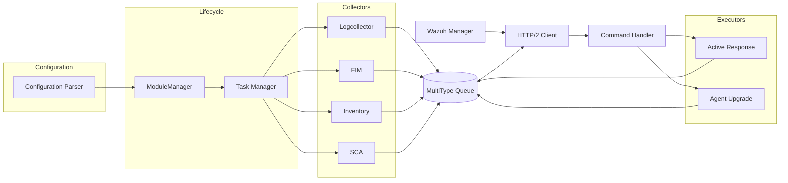
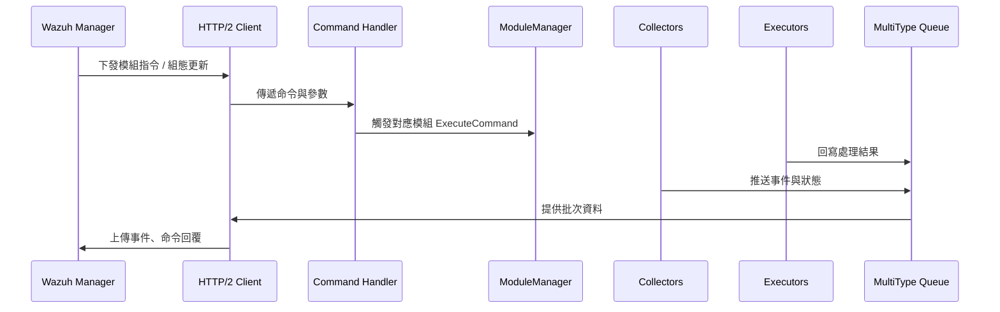

# 功能模組（Collectors / Executors）深度解析

## 模組協調架構與共通流程

Wazuh Agent 的模組由 `ModuleManager` 在啟動期間註冊與管理，統一注入訊息推播函式與設定解析器。每個模組啟動時會由 Task Manager 排入執行緒，並在 `Setup` 中套用 YAML 設定後以 `Run` 進入主要工作迴圈；停止時則透過 `Stop` 回收資源。【F:src/modules/src/moduleManager.cpp†L21-L172】

Collectors 與 Executors 共用的資料管線如下：

## Collectors 模組

### Logcollector

- **啟動與任務調度**：進入 `Run` 時若模組啟用即呼叫 `TaskManager::RunSingleThread`，並以協程包裝讀取工作，配合活躍 reader 計數器確保關閉時能安全等待。【F:src/modules/logcollector/src/logcollector.cpp†L24-L104】
- **設定與資料來源載入**：`Setup` 會讀取 `logcollector` 區段的啟用旗標、檔案輪詢間隔與來源列表，為每個來源建立 `FileReader` 並掛上排程與延遲等待函式，必要時加入平台特定 reader。【F:src/modules/logcollector/src/logcollector.cpp†L56-L96】
- **訊息推播**：`PushMessage` 會將來源路徑、原始事件與產生時間打包成 JSON，依 Collector 類型決定 metadata 後透過 MultiType Queue 推送，供 HTTP Client 後送至 Manager。【F:src/modules/logcollector/src/logcollector.cpp†L135-L163】

### File Integrity Monitoring（FIM）

- **守護行程初始化**：`main` 讀取參數後設定權限、載入組態並啟動 Rootcheck、訊號處理與 MQ 連線，列出所有監控目錄與設定摘要，確保排程前環境完整。【F:src/modules/fim/src/main.c†L44-L258】
- **即時監控與排程**：`realtime_start` 與 `fim_add_inotify_watch` 會建立 inotify 監視器並記錄對應目錄，若資源不足則回退至排程模式。【F:src/modules/fim/src/run_realtime.c†L36-L143】
- **事件發布**：FIM 執行期間透過 MQ 將檔案變更結果與 Diff 傳回核心 Queue，由 Agent 後續上傳，並在模組關閉時釋放所有 watch 與資源。【F:src/modules/fim/src/main.c†L193-L258】【F:src/modules/fim/src/run_realtime.c†L145-L197】

### Inventory

- **啟動流程**：`Run` 檢查模組是否啟用，建立 `SysInfo` 抽象並呼叫 `Init` 啟動資產掃描，記錄資料庫路徑與正規化設定。【F:src/modules/inventory/src/inventory.cpp†L9-L43】
- **設定載入**：`Setup` 讀取多種掃描旗標（硬體、系統、網路、套件等），並設定資料庫與正規化檔案位置，支援定期輪詢與啟動時掃描。【F:src/modules/inventory/src/inventory.cpp†L46-L74】
- **事件分派**：`PushMessage` 會根據差異結果產生 Stateful 與 Stateless 訊息，若包含刪除事件則以空物件回傳狀態，並將額外 stateless 清單分開推送以減少資料冗餘。【F:src/modules/inventory/src/inventory.cpp†L110-L153】

### Security Configuration Assessment（SCA）

- **資料庫與依賴初始化**：建構子建立 SQLite 資料庫與檔案系統封裝，確保政策與檢查結果持久化存放。【F:src/modules/sca/src/sca.cpp†L12-L53】
- **設定應用與政策載入**：`Setup` 讀取啟用旗標、掃描間隔與是否開機掃描，並透過 `SCAPolicyLoader` 解析規範，同步差異至 Manager。【F:src/modules/sca/src/sca.cpp†L66-L107】
- **排程執行**：每個政策的 `Run` 都會被包成協程任務，遇到掃描結果時由 `SCAEventHandler` 回寫 Queue，Task Manager 則管理定時器與停止流程。【F:src/modules/sca/src/sca.cpp†L86-L116】

## Executors 模組

### Active Response（Execd）

- **守護行程啟動**：`main` 解析參數、檢查權限後讀入 `execd` 設定，建立訊號處理、命令通訊執行緒與 MQ 連線，最後進入 `ExecdStart` 迴圈等待指令。【F:src/modules/active_response/src/main.c†L44-L175】
- **指令排程與逾時處理**：`ExecdStart` 使用 `select` 監聽執行隊列，並透過 `ExecdTimeoutRun` 管理延遲執行的命令；每當收到 JSON 命令即交給 `ExecdRun` 驗證與啟動對應腳本。【F:src/modules/active_response/src/execd.c†L415-L498】
- **命令查表**：`ReadExecConfig` 與 `GetCommandbyName` 解析共享組態，過濾目錄遍歷風險並提供逾時計時值，確保只有授權腳本能被執行。【F:src/modules/active_response/src/exec.c†L26-L190】

### Agent Upgrade

- **命令通道**：模組啟動時建立 Unix Domain Socket，持續接收升級請求並交由 `wm_agent_upgrade_process_command` 回應，確保外部工具可觸發升級行為。【F:src/modules/upgrade/src/wm_agent_upgrade_agent.c†L93-L189】
- **狀態回報與重試**：`wm_agent_upgrade_check_status` 會連線 MQ、輪詢 `upgrade_result` 檔案並依等待間隔逐步回報結果；`wm_upgrade_agent_send_ack_message` 將狀態包成任務訊息送往 Manager，失敗時會重建 MQ 連線再試，保障回傳可靠性。【F:src/modules/upgrade/src/wm_agent_upgrade_agent.c†L193-L286】

## Collectors 與 Executors 的互動流程

以下序列圖說明 Manager 指令與模組間的往返：

透過上述架構，Collectors 專注於資料蒐集與狀態同步，Executors 則負責執行 Manager 下達的主動操作，兩者皆依賴共同的 Queue 與 Command Handler 與核心模組協作，確保代理端既能回報安全事件也能響應集中化控制。【F:references/wazuh-agent-architecture.md†L8-L47】【F:src/modules/src/moduleManager.cpp†L39-L172】
