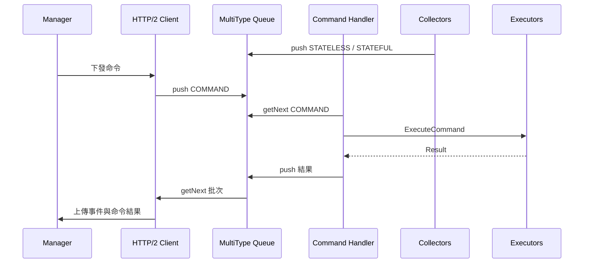

# 功能模組（Collectors / Executors）指南

Wazuh Agent 的功能模組由 Module Manager 管理，於啟動時註冊、套用設定並透過 Task Manager 以非同步方式運行。Collectors 專注於資料蒐集，Executors 則處理由 Manager 下達的主動命令或長期任務。【F:src/modules/src/moduleManager.cpp†L39-L172】

## 模組總覽

Module Manager 在 `AddModules` 階段依平台條件建立模組實例，呼叫 `Setup` 套用 Configuration Parser 中的設定，並在 `Start` 時把 `Run` 任務排入 Task Manager 的執行緒池。【F:src/modules/src/moduleManager.cpp†L39-L151】Collectors 透過 `m_pushMessage` 將事件寫入 MultiType Queue；Executors 則回寫命令結果，供 HTTP/2 Client 批次上傳。【F:src/modules/logcollector/src/logcollector.cpp†L135-L163】【F:src/modules/inventory/src/inventory.cpp†L110-L153】【F:src/modules/active_response/src/execd.c†L415-L498】

### Collectors

| 模組 | 主要責任 | 設定重點 / 實作亮點 |
| --- | --- | --- |
| Logcollector | 依設定建立多個讀取器，透過協程讀檔並推送 stateless 訊息 | `Setup` 解析啟用旗標、輪詢間隔與來源；每個 reader 透過 `PushMessage` 將事件序列化後進入 Queue。【F:src/modules/logcollector/src/logcollector.cpp†L24-L163】 |
| File Integrity Monitoring (FIM) | 監控檔案變更並回傳差異，支援排程與 inotify 實時模式 | `main` 載入設定、初始化 rootcheck 與 MQ；`realtime_start` 建立 inotify watcher，若資源不足會回退排程模式。【F:src/modules/fim/src/main.c†L56-L199】【F:src/modules/fim/src/run_realtime.c†L36-L143】 |
| Inventory | 收集硬體、系統、網路等資產資訊，產生 stateful/stateless 差異訊息 | `Setup` 讀取資料庫與掃描選項；`Run` 建立 `SysInfo` 並註冊差異回呼，`PushMessage` 將刪除與新增結果分流推送。【F:src/modules/inventory/src/inventory.cpp†L9-L153】 |
| Security Configuration Assessment (SCA) | 解析政策、排程掃描並回報檢查結果 | 建構子建立 SQLite 儲存；`Setup` 載入政策並使用 Task Manager 排程掃描，事件由 `SCAEventHandler` 回寫 Queue。【F:src/modules/sca/src/sca.cpp†L35-L116】 |

### Executors

| 模組 | 主要責任 | 設定重點 / 實作亮點 |
| --- | --- | --- |
| Active Response (Execd) | 接收命令、執行對應腳本並處理逾時與重複限制 | `main` 解析參數後啟動訊號處理與 MQ 連線；`ExecdStart` 使用 `select` 監聽命令佇列並根據配置派發或取消命令。【F:src/modules/active_response/src/main.c†L44-L176】【F:src/modules/active_response/src/execd.c†L360-L498】 |
| Agent Upgrade | 監聽本地 Unix Socket 接收升級指令，並將結果回報 Manager | `wm_agent_upgrade_listen_messages` 處理外部命令並回覆；`wm_agent_upgrade_check_status` 監控結果檔案、以退避策略重送任務訊息。【F:src/modules/upgrade/src/wm_agent_upgrade_agent.c†L93-L224】 |

## 任務與命令流程

1. **設定套用**：Module Manager 在 `Setup` 中傳入 Configuration Parser，模組據此讀取啟用旗標、間隔與檔案路徑等參數。【F:src/modules/src/moduleManager.cpp†L153-L160】【F:src/modules/logcollector/src/logcollector.cpp†L56-L96】【F:src/modules/inventory/src/inventory.cpp†L46-L74】
2. **資料產生**：Collectors 在 `Run` 或排程的協程中取得資料後，透過共享的 `PushMessage` 函式推入 MultiType Queue。【F:src/modules/logcollector/src/logcollector.cpp†L24-L169】【F:src/modules/sca/src/sca.cpp†L95-L116】
3. **命令執行**：Command Handler 取出 COMMAND 類訊息並呼叫對應模組的 `ExecuteCommand` 或系統處理程序，完成後將結果重新推入 Queue。【F:src/agent/command_handler/src/command_handler.cpp†L121-L141】【F:src/agent/src/agent.cpp†L171-L197】
4. **批次上送**：HTTP/2 Client 依 `Agent::Run` 安排的任務從 Queue 取出 stateful/stateless 事件與命令回報，批次傳送給 Manager。【F:src/agent/src/agent.cpp†L147-L169】

## 開發提示

- **新增模組**：建立 `IModule` 實作後於 Module Manager 註冊，並確保 `Setup` 支援 Configuration Parser 預設值，以便集中化組態熱更新。【F:src/modules/src/moduleManager.cpp†L39-L104】
- **命令支援**：若模組需要遠端命令，實作 `ExecuteCommand` 並於 Command Handler 的命令對映表中註冊參數驗證邏輯。【F:src/modules/logcollector/src/logcollector.cpp†L105-L123】【F:src/agent/command_handler/src/command_handler.cpp†L20-L200】
- **Queue 效能**：長時間任務應善用 Task Manager 的協程或定時器，避免阻塞 Queue 的批次機制。【F:src/modules/sca/src/sca.cpp†L86-L116】【F:src/agent/task_manager/src/task_manager.cpp†L117-L148】

