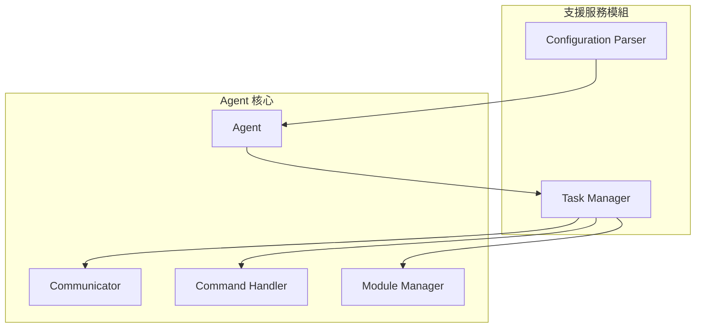
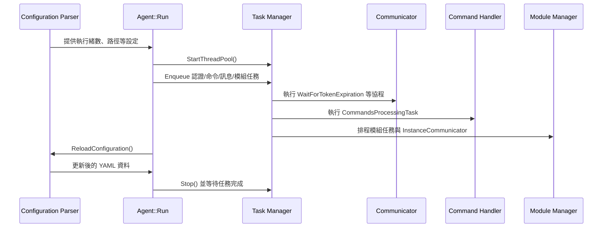

# 支援服務模組深度解析

本文件整理 Wazuh Agent 中「支援服務模組」的兩大元件——Configuration Parser 與 Task Manager——的職責、運作流程與與其他元件的互動，補充《Wazuh Agent 架構與元件分析》中對支援服務的概述，協助讀者快速對照程式碼實作位置。

## 元件概觀

| 元件 | 功能摘要 | 主要檔案 |
| --- | --- | --- |
| Configuration Parser | 從本地與共享 YAML 組態來源載入設定，提供型別檢查、數值範圍與單位換算後的查詢介面。 | `src/agent/configuration_parser/include/configuration_parser.hpp`、`src/agent/configuration_parser/src/configuration_parser.cpp` |
| Task Manager | 建立並管理 Boost.Asio 執行緒池、協程排程與定時器，確保代理程式的非同步工作得以串接執行。 | `src/agent/task_manager/include/task_manager.hpp`、`src/agent/task_manager/src/task_manager.cpp` |

## Configuration Parser

1. **載入流程**：
   - 建構時預設從 `config::DEFAULT_CONFIG_PATH` 下的 `wazuh-agent.yml` 讀取本地組態，失敗時以空節點回退並寫入警告記錄。【F:src/agent/configuration_parser/src/configuration_parser.cpp†L14-L52】
   - 呼叫 `SetGetGroupIdsFunction` 後，會透過中央化組態回傳的群組清單載入共享組態檔，並利用 `MergeYamlNodes` 合併多份設定。【F:src/agent/configuration_parser/src/configuration_parser.cpp†L74-L116】

2. **查詢能力**：
   - `GetConfigOrDefault` 與 `GetConfigInRangeOrDefault` 透過範本方法遞迴索引 YAML 節點，若資料缺失或型別轉換失敗會回傳預設值並紀錄提示。【F:src/agent/configuration_parser/include/configuration_parser.hpp†L35-L123】【F:src/agent/configuration_parser/include/configuration_parser.hpp†L171-L237】
   - 針對時間與容量等字串數值提供 `GetTimeConfigOrDefault`、`GetBytesConfigInRangeOrDefault`，內部委派 `GetParsedConfigInRangeOrDefault` 進行單位解析。【F:src/agent/configuration_parser/include/configuration_parser.hpp†L125-L170】

3. **持續運作**：
   - `ReloadConfiguration` 會重置緩存、重新讀取本地與共享組態，確保更新即時生效。【F:src/agent/configuration_parser/src/configuration_parser.cpp†L118-L141】
   - `Agent` 建構時會注入群組查詢函式，並從配置抓取執行緒數與路徑等參數，讓其他模組在 `Run()` 前即可共用配置資料。【F:src/agent/src/agent.cpp†L21-L86】

## Task Manager

1. **執行緒與資源控管**：
   - `StartThreadPool` 建立指定數量的執行緒並綁定到 `boost::asio::io_context`，必要時重新啟動停止過的 context 並建立 work guard。【F:src/agent/task_manager/src/task_manager.cpp†L14-L43】
   - `RunSingleThread` 可在目前執行緒同步運行 `io_context`，並透過 `m_numAdditionalThreads` 計數器追蹤額外執行緒來源。【F:src/agent/task_manager/src/task_manager.cpp†L45-L65】
   - `Stop` 會釋放 work guard、停止 context 並等待所有執行緒 join 完成，同時重設排程計數。【F:src/agent/task_manager/src/task_manager.cpp†L67-L92】

2. **工作排程**：
   - 對函式物件的 `EnqueueTask` 使用 `boost::asio::post` 派送至執行緒池，並在工作前後調整計數、捕捉例外。【F:src/agent/task_manager/src/task_manager.cpp†L94-L123】
   - 對 `awaitable` 工作則透過 `boost::asio::co_spawn` 啟動協程並集中處理例外。【F:src/agent/task_manager/src/task_manager.cpp†L125-L148】
   - 內建 `CreateSteadyTimer` 以產生與 Task Manager 生命周期同調的非同步定時器，給長時間運作的任務使用。【F:src/agent/task_manager/src/task_manager.cpp†L162-L165】

3. **與核心元件的串接**：
   - `Agent::Run` 啟動 Task Manager 後，依序把認證、命令輪詢、訊息傳輸、模組任務與 Instance Communicator 等協程/函式排入隊列，成為整體事件循環的中樞。【F:src/agent/src/agent.cpp†L88-L201】
   - 在代理關閉流程中，Task Manager 停止後其他元件（Command Handler、Communicator、Module Manager 等）才會釋放資源，確保非同步任務先行結束。【F:src/agent/src/agent.cpp†L203-L214】

## 流程圖

