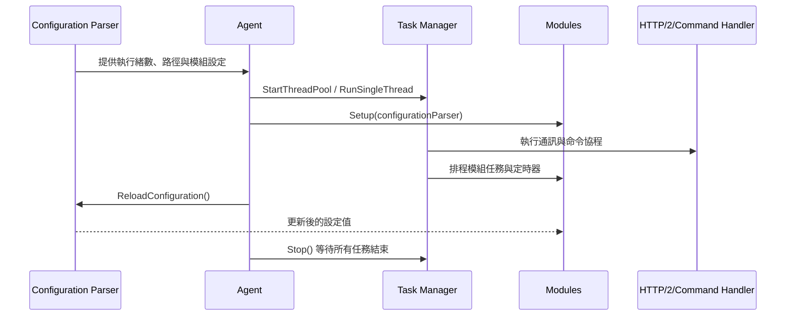

# 支援服務模組指南

支援服務模組包含 Configuration Parser 與 Task Manager，兩者在 Agent 啟動時先行建立，為核心通訊與功能模組提供設定來源與非同步執行環境。【F:src/agent/src/agent.cpp†L21-L188】

## 元件一覽

| 元件 | 角色 | 相關檔案 |
| --- | --- | --- |
| Configuration Parser | 載入本地與集中化 YAML，提供型別安全的查詢介面並支援即時重載 | `src/agent/configuration_parser/src/configuration_parser.cpp`、`include/configuration_parser.hpp`【F:src/agent/configuration_parser/src/configuration_parser.cpp†L20-L158】【F:src/agent/configuration_parser/include/configuration_parser.hpp†L18-L237】 |
| Task Manager | 以 Boost.Asio 建立執行緒池與協程排程，集中管理背景工作生命週期 | `src/agent/task_manager/src/task_manager.cpp`【F:src/agent/task_manager/src/task_manager.cpp†L16-L165】 |

## Configuration Parser

1. **初始化流程**：建構子預設讀取 `wazuh-agent.yml`，若 YAML 結構無效則回退為空節點並記錄警告，確保 Agent 不因設定錯誤而終止。【F:src/agent/configuration_parser/src/configuration_parser.cpp†L20-L63】
2. **集中化設定**：`SetGetGroupIdsFunction` 會查詢群組清單並載入對應共享檔案，`MergeYamlNodes` 將多份 YAML 合併；重載時先清空緩存再重新讀取本地與共享來源。【F:src/agent/configuration_parser/src/configuration_parser.cpp†L97-L158】
3. **查詢介面**：範本化的 `GetConfigOrDefault`、`GetConfigInRangeOrDefault` 與時間/容量解析函式提供預設值與範圍檢查，並在型別錯誤時回傳預設值與提示。【F:src/agent/configuration_parser/include/configuration_parser.hpp†L45-L170】
4. **與核心整合**：`Agent` 啟動時注入群組查詢函式並讀取執行緒數、資料路徑等參數，模組在 `Setup` 階段可直接使用解析後的配置值。【F:src/agent/src/agent.cpp†L56-L86】【F:src/modules/logcollector/src/logcollector.cpp†L56-L96】

### 設定矩陣

| 消費者 | 設定鍵 (YAML path) | 預設值 / 型別 | 驗證與 fallback 規則 |
| --- | --- | --- | --- |
| Agent | `agent.thread_count` | `config::DEFAULT_THREAD_COUNT` (`size_t`，預設 4) | 透過 `GetConfigInRangeOrDefault` 強制大於等於預設值；缺值或超出範圍時採預設並記錄警告。【F:src/agent/src/agent.cpp†L102-L108】【F:src/agent/configuration_parser/include/configuration_parser.hpp†L83-L113】|
| Agent / 多模組 | `agent.path.data` | `config::DEFAULT_DATA_PATH` (`std::string`，平台化路徑) | `GetConfigOrDefault` 無額外檢查；若本地檔案遺失則回退預設路徑，用於訊息儲存與資料庫位置。【F:src/agent/src/agent.cpp†L32-L60】【F:src/agent/multitype_queue/src/multitype_queue.cpp†L31-L44】【F:src/modules/inventory/src/inventory.cpp†L55-L60】|
| Communicator | `agent.server_url` | `config::agent::DEFAULT_SERVER_URL` (`std::string`，預設 `https://localhost:27000`) | 無額外驗證；若非 https 只記錄資訊訊息。缺值回退預設。【F:src/agent/communicator/src/communicator.cpp†L64-L72】【F:src/common/config/include/config.h.in†L16-L24】【F:src/cmake/config.cmake†L24-L33】|
| Communicator | `agent.retry_interval` | `config::agent::DEFAULT_RETRY_INTERVAL` (`time_t`，30s) | `GetTimeConfigOrDefault`：解析失敗或非正值時回退預設值並記錄警告。【F:src/agent/communicator/src/communicator.cpp†L74-L76】【F:src/agent/configuration_parser/include/configuration_parser.hpp†L114-L134】【F:src/cmake/config.cmake†L28-L34】|
| Communicator | `events.batch_size` | `config::agent::DEFAULT_BATCH_SIZE` (`size_t`，1 MB) | `GetBytesConfigInRangeOrDefault` 將值限制在 1 000–100 000 000 bytes，超出或解析錯誤回退預設。【F:src/agent/communicator/src/communicator.cpp†L78-L83】【F:src/agent/configuration_parser/include/configuration_parser.hpp†L136-L170】|
| Communicator | `agent.verification_mode` | `config::agent::DEFAULT_VERIFICATION_MODE` (`std::string`，允許 `full`/`certificate`/`none`) | 非白名單值時寫入警告並回退預設模式。【F:src/agent/communicator/src/communicator.cpp†L85-L94】【F:src/common/config/include/config.h.in†L18-L23】|
| Communicator | `agent.commands_request_timeout` | `config::agent::DEFAULT_COMMANDS_REQUEST_TIMEOUT` (`time_t`，11 分鐘) | 以 `GetTimeConfigInRangeOrDefault` 驗證，但目前最小值 15 分鐘、大於最大值 10 秒導致區間無效，函式立即回退預設並記錄警告（潛在瑕疵）。【F:src/agent/communicator/src/communicator.cpp†L95-L103】【F:src/agent/configuration_parser/include/configuration_parser.hpp†L83-L113】|
| MultiTypeQueue | `events.batch_interval` | `config::agent::DEFAULT_BATCH_INTERVAL` (`time_t`，10 秒) | 限制在 1–3600 秒；超界或格式錯誤回退預設。【F:src/agent/multitype_queue/src/multitype_queue.cpp†L23-L28】【F:src/cmake/config.cmake†L34-L40】|
| MultiTypeQueue | `agent.queue_size` | `config::agent::QUEUE_DEFAULT_SIZE` (`size_t`，10 000) | 限制在 1 000–3 600 000；超界或格式錯誤回退預設。【F:src/agent/multitype_queue/src/multitype_queue.cpp†L29-L31】【F:src/cmake/config.cmake†L48-L56】|
| Logcollector | `logcollector.enabled` | `config::logcollector::DEFAULT_ENABLED` (`bool`，預設 true) | 缺值回退預設；若整個模組禁用則停止建立讀取器。【F:src/modules/logcollector/src/logcollector.cpp†L56-L68】【F:src/cmake/config.cmake†L40-L48】|
| Logcollector | `logcollector.read_interval` | `config::logcollector::DEFAULT_FILE_WAIT` (`time_t`，500 ms) | 讀取與等待時間共用；解析錯誤回退預設並警告。【F:src/modules/logcollector/src/logcollector.cpp†L70-L83】【F:src/modules/logcollector/src/logcollector_unix.cpp†L12-L31】【F:src/modules/logcollector/src/logcollector_osx.cpp†L31-L48】|
| Logcollector | `logcollector.reload_interval` | `config::logcollector::DEFAULT_RELOAD_INTERVAL` (`time_t`，60 秒) | 用於檔案重新載入與 Windows 事件輪詢；解析錯誤回退預設。【F:src/modules/logcollector/src/logcollector.cpp†L75-L80】【F:src/modules/logcollector/src/logcollector_win.cpp†L14-L25】|
| Logcollector | `logcollector.localfiles` | 預設 `["/var/log/auth.log"]` (`std::vector<std::string>`) | 無額外驗證；缺值時以單一檔案啟動檔案監聽。【F:src/modules/logcollector/src/logcollector.cpp†L82-L95】【F:src/common/config/include/config.h.in†L26-L33】|
| Logcollector (Linux) | `logcollector.journald` | 預設空 `YAML::Node` (Sequence) | 逐條解析 `field/value/exact_match`；型別錯誤略過該條件並繼續。【F:src/modules/logcollector/src/logcollector_unix.cpp†L12-L44】|
| Logcollector (Windows) | `logcollector.windows` | 預設空 `std::vector<std::map<std::string,std::string>>` | 未提供額外驗證；缺值時不建立事件追蹤讀取器。【F:src/modules/logcollector/src/logcollector_win.cpp†L14-L31】|
| Logcollector (macOS) | `logcollector.macos` | 預設空 `std::vector<std::map<std::string,std::string>>` | 未提供額外驗證；若提供 `type` 欄位會被拆成陣列後建構讀取器。【F:src/modules/logcollector/src/logcollector_osx.cpp†L32-L55】|
| Inventory | `inventory.enabled` | `config::inventory::DEFAULT_ENABLED` (`bool`，預設 true) | 禁用時 `Run` 直接返回並清理快取。【F:src/modules/inventory/src/inventory.cpp†L43-L52】【F:src/cmake/config.cmake†L48-L67】|
| Inventory | `inventory.interval` | `config::inventory::DEFAULT_INTERVAL` (`time_t`，1 小時) | `GetTimeConfigOrDefault` 解析；錯誤回退預設。【F:src/modules/inventory/src/inventory.cpp†L61-L63】|
| Inventory | 其餘布林旗標 (`scan_on_start`、`hardware`、`system`、`networks`、`packages`、`ports`、`ports_all`、`processes`、`hotfixes`) | 各自對應 `config::inventory::DEFAULT_*` (`bool`) | `GetConfigOrDefault` 缺值回退預設；模組啟動時依旗標決定蒐集內容。【F:src/modules/inventory/src/inventory.cpp†L63-L74】【F:src/common/config/include/config.h.in†L34-L49】|
| SCA | `sca.enabled`、`sca.scan_on_start` | `config::sca::DEFAULT_*` (`bool`，預設 true) | 缺值回退預設；禁用時不建立任務管理器。【F:src/modules/sca/src/sca.cpp†L54-L83】【F:src/cmake/config.cmake†L67-L74】|
| SCA | `sca.interval` | `config::sca::DEFAULT_INTERVAL` (`time_t`，1 小時) | `GetTimeConfigOrDefault` 解析；錯誤回退預設。【F:src/modules/sca/src/sca.cpp†L69-L76】|
| SCA | `sca.policies`、`sca.policies_disabled` | 預設空 `std::vector<std::string>` | 逐一檢查檔案存在與否；不存在者記錄警告並忽略。【F:src/modules/sca/src/sca_policy_loader.cpp†L12-L41}|

### 熱載流程與錯誤 fallback

1. **載入順序**：`ReloadConfiguration()` 會先清空當前節點，再重讀本地檔案、最後合併群組共享設定，確保更新過程覆蓋舊值。【F:src/agent/configuration_parser/src/configuration_parser.cpp†L120-L158】
2. **本地檔錯誤處理**：`LoadLocalConfig()` 檢測 YAML 結構；若解析失敗或檔案無效，回退為空節點並警告，所有查詢即改用預設值。【F:src/agent/configuration_parser/src/configuration_parser.cpp†L32-L63】
3. **共享設定錯誤處理**：`SetGetGroupIdsFunction()` 會立刻載入共享設定；若未設群組回呼或個別群組 YAML 解析失敗，函式記錄警告並維持現有設定而不中止 Agent。【F:src/agent/configuration_parser/src/configuration_parser.cpp†L97-L143】
4. **查詢錯誤處理**：範本 `GetConfig` 捕捉型別轉換與路徑錯誤，分別輸出 `LogWarn` 與 `LogDebug`，最終回傳 `std::nullopt` 讓外層 fallback 至預設值。【F:src/agent/configuration_parser/include/configuration_parser.hpp†L90-L112】

### 模組與核心設定相依圖

- **Communicator ↔ ConfigurationParser**：需要 `server_url`、`retry_interval`、`batch_size`、`verification_mode` 與 `commands_request_timeout`，並在取得認證資訊後提供集中化設定下載功能。【F:src/agent/communicator/src/communicator.cpp†L64-L118】【F:src/agent/src/agent.cpp†L28-L72】
- **MultiTypeQueue ↔ ConfigurationParser**：依賴 `batch_interval`、`queue_size` 與 `path.data` 決定訊息批次與儲存位置，並由 Agent 與模組透過同一實體佇列傳遞資料。【F:src/agent/multitype_queue/src/multitype_queue.cpp†L16-L44】【F:src/agent/src/agent.cpp†L24-L52】
- **TaskManager**：雖無直接設定鍵，卻被 Logcollector、SCA 等模組在 `Setup` 後透過 `EnqueueTask` 與計時器建立協程流程，受 `ConfigurationParser` 啟用旗標影響是否排程任務。【F:src/modules/logcollector/src/logcollector.cpp†L51-L118】【F:src/modules/sca/src/sca.cpp†L78-L116】【F:src/agent/task_manager/src/task_manager.cpp†L16-L165】
- **Logcollector / Inventory / SCA Modules**：各自於 `Setup` 階段讀取對應節點，ModuleManager 在 Agent 初始化時注入同一 `ConfigurationParser` 實例，確保重載時可共享更新值。【F:src/modules/src/moduleManager.cpp†L19-L86】【F:src/modules/logcollector/src/logcollector.cpp†L56-L96】【F:src/modules/inventory/src/inventory.cpp†L43-L74】【F:src/modules/sca/src/sca.cpp†L54-L103】

### 重構後的相容性措施建議

1. **版本化設定旗標**：於 YAML 根節點新增 `configuration_version`，由 `ConfigurationParser` 在載入後比對版本，低於新版本時可套用自動遷移或停用不支援的鍵並回傳警告，避免錯誤值在重載時造成行為落差。【F:src/agent/configuration_parser/src/configuration_parser.cpp†L120-L158】
2. **型別遷移腳本**：若未來調整欄位型別（例：`events.batch_size` 改為純整數），提供離線轉換工具或在啟動時偵測舊格式並寫入新檔，轉換後再呼叫 `ReloadConfiguration()`，確保模組取得一致格式。【F:src/agent/multitype_queue/src/multitype_queue.cpp†L16-L44】【F:src/agent/communicator/src/communicator.cpp†L64-L103】
3. **雙寫支援期間**：在 `Get*` 取值時同時檢查舊鍵（例如 `inventory.interval_ms`）與新鍵，若新鍵不存在則讀取舊值並記錄除役警告，待遷移完成後移除舊鍵支援。【F:src/modules/inventory/src/inventory.cpp†L61-L74】
4. **單元測試覆蓋**：針對新類型或路徑撰寫 `ConfigurationParser` 測試，確認範圍檢查與 fallback 行為；必要時在模組測試中模擬舊設定以驗證向下相容性。【F:src/agent/configuration_parser/tests/configuration_parser_test.cpp†L503-L613】
## Task Manager

1. **執行緒管理**：`StartThreadPool` 會建立 `io_context` 工作守護並啟動指定執行緒，`RunSingleThread` 則允許模組在自身執行緒運行非同步任務；`Stop` 會釋放守護與等待所有執行緒結束。【F:src/agent/task_manager/src/task_manager.cpp†L16-L92】
2. **任務排程**：同步任務透過 `boost::asio::post` 派送並以計數器追蹤；協程任務使用 `co_spawn`，捕捉例外後寫入日誌避免未處理異常。【F:src/agent/task_manager/src/task_manager.cpp†L93-L148】
3. **定時支援**：`CreateSteadyTimer` 生成與 Task Manager 生命周期綁定的定時器，搭配模組中的等待函式可構成協程排程基礎。【F:src/agent/task_manager/src/task_manager.cpp†L156-L165】【F:src/modules/logcollector/src/logcollector.cpp†L90-L92】
4. **Agent 整合**：`Agent::Run` 啟動 Task Manager 後，依序排入認證、訊息處理、命令流程與模組任務，並在關閉時呼叫 `Stop` 確保協程完成。【F:src/agent/src/agent.cpp†L134-L220】

## 整體流程

## 開發建議

- **新增設定欄位**：在 Configuration Parser 中新增查詢介面時，確保提供預設值與範圍驗證，並在相關模組的 `Setup` 中套用該函式，以保持集中化設定與本地預設一致。【F:src/agent/configuration_parser/include/configuration_parser.hpp†L45-L170】【F:src/modules/inventory/src/inventory.cpp†L55-L74】
- **長任務處理**：使用 Task Manager 的 `EnqueueTask` 與 `CreateSteadyTimer` 來建構協程或延遲任務，避免阻塞核心執行緒；停用模組時需先停止定時器並等待協程退出。【F:src/modules/logcollector/src/logcollector.cpp†L51-L104】【F:src/modules/sca/src/sca.cpp†L95-L116】

