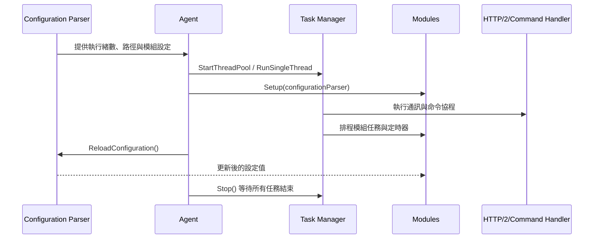

# 支援服務模組指南

支援服務模組包含 Configuration Parser 與 Task Manager，兩者在 Agent 啟動時先行建立，為核心通訊與功能模組提供設定來源與非同步執行環境。【F:src/agent/src/agent.cpp†L21-L188】

## 元件一覽

| 元件 | 角色 | 相關檔案 |
| --- | --- | --- |
| Configuration Parser | 載入本地與集中化 YAML，提供型別安全的查詢介面並支援即時重載 | `src/agent/configuration_parser/src/configuration_parser.cpp`、`include/configuration_parser.hpp`【F:src/agent/configuration_parser/src/configuration_parser.cpp†L20-L158】【F:src/agent/configuration_parser/include/configuration_parser.hpp†L18-L237】 |
| Task Manager | 以 Boost.Asio 建立執行緒池與協程排程，集中管理背景工作生命週期 | `src/agent/task_manager/src/task_manager.cpp`【F:src/agent/task_manager/src/task_manager.cpp†L16-L165】 |

## Configuration Parser

1. **初始化流程**：建構子預設讀取 `wazuh-agent.yml`，若 YAML 結構無效則回退為空節點並記錄警告，確保 Agent 不因設定錯誤而終止。【F:src/agent/configuration_parser/src/configuration_parser.cpp†L20-L63】
2. **集中化設定**：`SetGetGroupIdsFunction` 會查詢群組清單並載入對應共享檔案，`MergeYamlNodes` 將多份 YAML 合併；重載時先清空緩存再重新讀取本地與共享來源。【F:src/agent/configuration_parser/src/configuration_parser.cpp†L97-L158】
3. **查詢介面**：範本化的 `GetConfigOrDefault`、`GetConfigInRangeOrDefault` 與時間/容量解析函式提供預設值與範圍檢查，並在型別錯誤時回傳預設值與提示。【F:src/agent/configuration_parser/include/configuration_parser.hpp†L45-L170】
4. **與核心整合**：`Agent` 啟動時注入群組查詢函式並讀取執行緒數、資料路徑等參數，模組在 `Setup` 階段可直接使用解析後的配置值。【F:src/agent/src/agent.cpp†L56-L86】【F:src/modules/logcollector/src/logcollector.cpp†L56-L96】

## Task Manager

1. **執行緒管理**：`StartThreadPool` 會建立 `io_context` 工作守護並啟動指定執行緒，`RunSingleThread` 則允許模組在自身執行緒運行非同步任務；`Stop` 會釋放守護與等待所有執行緒結束。【F:src/agent/task_manager/src/task_manager.cpp†L16-L92】
2. **任務排程**：同步任務透過 `boost::asio::post` 派送並以計數器追蹤；協程任務使用 `co_spawn`，捕捉例外後寫入日誌避免未處理異常。【F:src/agent/task_manager/src/task_manager.cpp†L93-L148】
3. **定時支援**：`CreateSteadyTimer` 生成與 Task Manager 生命周期綁定的定時器，搭配模組中的等待函式可構成協程排程基礎。【F:src/agent/task_manager/src/task_manager.cpp†L156-L165】【F:src/modules/logcollector/src/logcollector.cpp†L90-L92】
4. **Agent 整合**：`Agent::Run` 啟動 Task Manager 後，依序排入認證、訊息處理、命令流程與模組任務，並在關閉時呼叫 `Stop` 確保協程完成。【F:src/agent/src/agent.cpp†L134-L220】

## 整體流程

## 開發建議

- **新增設定欄位**：在 Configuration Parser 中新增查詢介面時，確保提供預設值與範圍驗證，並在相關模組的 `Setup` 中套用該函式，以保持集中化設定與本地預設一致。【F:src/agent/configuration_parser/include/configuration_parser.hpp†L45-L170】【F:src/modules/inventory/src/inventory.cpp†L55-L74】
- **長任務處理**：使用 Task Manager 的 `EnqueueTask` 與 `CreateSteadyTimer` 來建構協程或延遲任務，避免阻塞核心執行緒；停用模組時需先停止定時器並等待協程退出。【F:src/modules/logcollector/src/logcollector.cpp†L51-L104】【F:src/modules/sca/src/sca.cpp†L95-L116】

