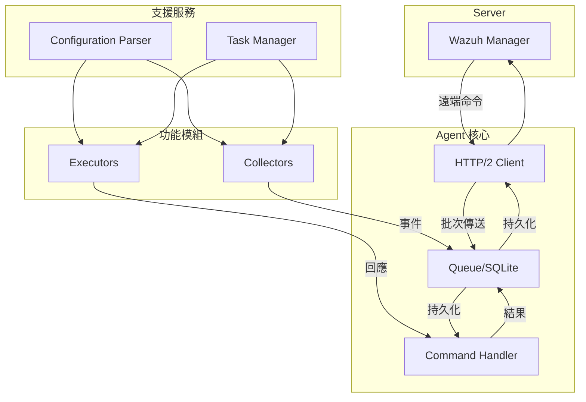
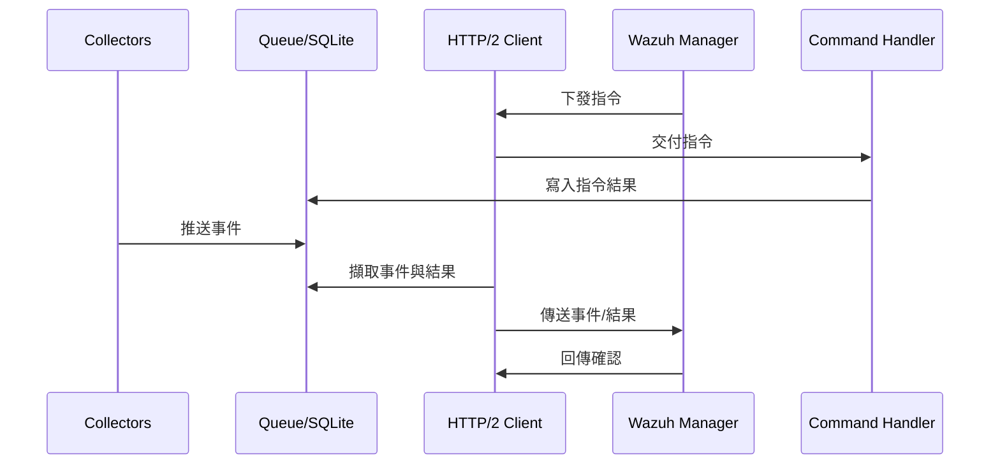
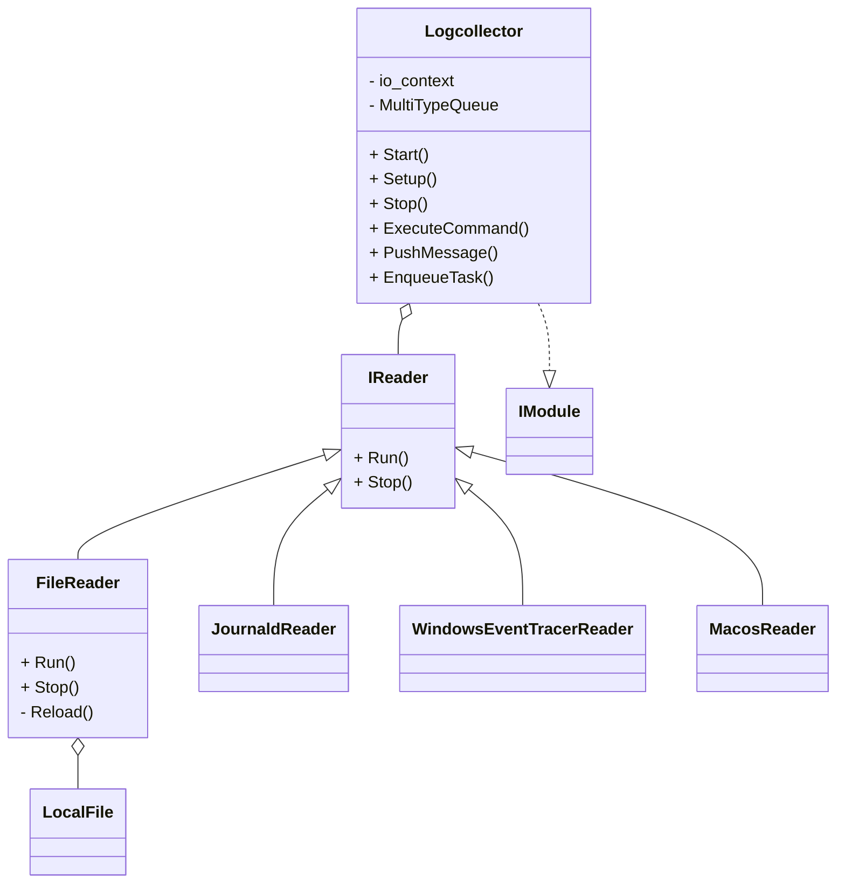

# Wazuh Agent 架構與元件分析

> 延伸閱讀：若需 HTTP/2 Client、MultiType Queue 與 Command Handler 的詳細工作流程與程式碼位置，請參考《[Wazuh Agent 核心元件深度解析](agent-core-core-components.md)》。

## 核心元件概覽

Wazuh Agent 透過清楚分工的元件協作，達成安全事件的蒐集、緩衝與傳送。其核心元件如下：

- **Agent 核心**：包含 HTTP/2 Client、Queue 及 Command Handler。Client 透過 Boost.Asio 建立 HTTP/2 連線並處理認證與逾時；Queue 以 SQLite 保存事件與命令；Command Handler 負責驗證與執行命令並回寫結果。【F:docs/ref/introduction/architecture.md†L5-L44】【F:src/agent/http_client/src/http_client.cpp†L103-L180】【F:src/agent/multitype_queue/src/multitype_queue.cpp†L53-L224】【F:src/agent/command_handler/src/command_handler.cpp†L67-L170】
- **Configuration Parser**：自 YAML 檔案或字串載入設定，提供其他模組查詢配置的能力。【F:docs/ref/introduction/architecture.md†L5-L32】
- **Task Manager**：建立與管理執行緒，安排模組化工作的排程與生命週期。【F:docs/ref/introduction/architecture.md†L5-L32】
- **Modules**：分為 Collectors 與 Executors。Collectors 進行日誌、檔案完整性、資安基線與資產清查等資料蒐集；Executors 處理升級、集中化配置與主動回應等操作；更多任務拆解可參考《[功能模組（Collectors / Executors）深度解析](functional-modules-collectors-executors.md)》。
【F:docs/ref/introduction/architecture.md†L33-L44】
- **Dependencies**：SQLite 提供 Queue 與 Command Handler 的持久化儲存；HTTP Client 供 Client 建立安全連線。【F:docs/ref/introduction/architecture.md†L24-L32】
- **Server/Manager**：在伺服端接收 Agent 上傳的事件並發送遠端命令，是整體協調中心。【F:docs/ref/introduction/architecture.md†L5-L44】

## 工作流程說明

1. **設定載入與排程啟動**：Agent 啟動時，Configuration Parser 讀取 YAML 設定；Task Manager 依設定啟動對應的模組執行緒並安排排程工作。【F:docs/ref/introduction/architecture.md†L17-L32】【F:src/agent/configuration_parser/src/configuration_parser.cpp†L20-L63】【F:src/agent/task_manager/src/task_manager.cpp†L16-L65】
2. **資料蒐集**：Collectors（例如 Logcollector、FIM、SCA 與 Inventory）依排程或事件觸發蒐集資訊，並透過 Queue 推送事件資料。【F:docs/ref/introduction/architecture.md†L33-L44】
3. **命令執行與回饋**：Wazuh Manager 可下發指令，由 Client 取回並交給 Command Handler 執行；Command Handler 驗證命令、寫入命令資料庫並觸發對應模組，執行結果再透過 Queue 回送。Executors 亦在此階段處理升級、主動回應等操作。【F:docs/ref/introduction/architecture.md†L5-L44】【F:src/agent/command_handler/src/command_handler.cpp†L67-L141】
4. **事件傳送**：Client 從 Queue 取出事件與命令結果，透過 HTTP/2 與 Manager 交換資料，Queue 以 SQLite 確保傳送前後的資料一致與持久化。【F:docs/ref/introduction/architecture.md†L5-L44】

## 功能模組互動重點

- **啟動與排程**：`ModuleManager` 在初始化時會將 Logcollector、FIM、Inventory、SCA 等 Collectors 與 Active Response、Agent Upgrade 等 Executors 註冊到 Task Manager，並統一注入訊息推播函式與設定解析器。【F:src/modules/src/moduleManager.cpp†L39-L160】
- **資料路徑**：Collectors 經由 MultiType Queue 發佈事件，Executors 在命令執行後回寫結果；兩者都透過 HTTP/2 Client 與 Command Handler 與 Manager 互動，其細節可參考延伸閱讀的架構與流程圖。【F:references/functional-modules-collectors-executors.md†L5-L112】

## 支援服務模組詳解

> 延伸閱讀：更多互動流程與 mermaid 圖示請見《[支援服務模組深度解析](support-services-module.md)》。

### Configuration Parser

- 建構時會先載入本地 `wazuh-agent.yml`，若檔案無效則回退為空節點並留下警告，確保代理啟動不被錯誤組態阻斷。【F:src/agent/configuration_parser/src/configuration_parser.cpp†L20-L63】
- 呼叫 `SetGetGroupIdsFunction` 後會依群組清單合併共享組態檔，`ReloadConfiguration` 則重載所有設定，支援集中化下發的即時更新。【F:src/agent/configuration_parser/src/configuration_parser.cpp†L97-L158】【F:src/agent/src/agent.cpp†L55-L126】
- 範本化的 `GetConfigOrDefault`、`GetConfigInRangeOrDefault` 與時間、容量解析函式提供型別安全與範圍檢查的查詢介面，讓其他模組能以預設值容錯。【F:src/agent/configuration_parser/include/configuration_parser.hpp†L45-L170】

### Task Manager

- 以 Boost.Asio 為核心，提供執行緒池啟動、單執行緒執行與安全停止機制，並追蹤排入的同步任務數量。【F:src/agent/task_manager/src/task_manager.cpp†L16-L123】【F:src/agent/task_manager/include/task_manager.hpp†L16-L63】
- 支援 `awaitable` 協程排程與例外集中處理，亦能產生生命周期受控的定時器，方便長期背景任務使用。【F:src/agent/task_manager/src/task_manager.cpp†L125-L165】
- `Agent::Run` 將認證、命令處理、訊息傳輸與 Instance Communicator 等協程託管給 Task Manager，成為代理運行期間的事件迴圈樞紐。【F:src/agent/src/agent.cpp†L134-L220】

## 模組延伸：Logcollector 範例

Logcollector 模組示範了 Collectors 的運作方式：

- **Logcollector 類別**：實作 IModule，維護多型佇列、設定載入、命令執行與訊息推送能力。【F:docs/ref/modules/logcollector/architecture.md†L5-L33】
- **Reader 階層**：透過 IReader 介面定義共同行為，並依平台與來源衍生如 FileReader、JournaldReader、WindowsEventTracerReader 與 MacosReader 等讀取器。【F:docs/ref/modules/logcollector/architecture.md†L15-L44】
- **LocalFile**：提供 FileReader 使用的檔案來源抽象，支援多路徑與輪詢策略。【F:docs/ref/modules/logcollector/architecture.md†L17-L36】

上述設計讓 Logcollector 能跨平台整合多種事件來源，並統一將資料送入 Queue，與其他模組共享一致流程。

