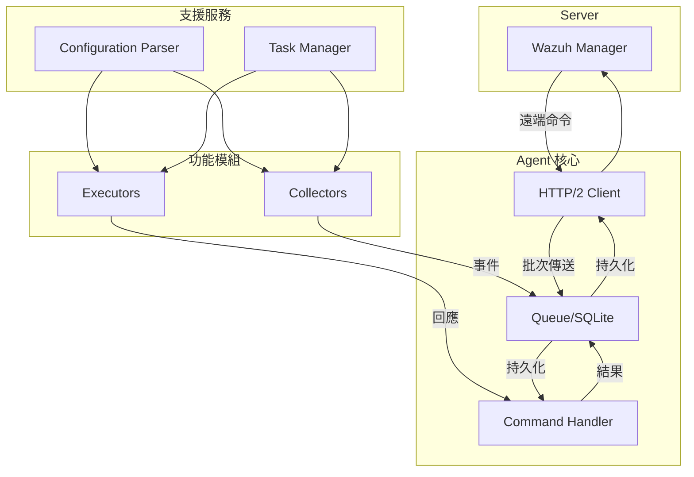
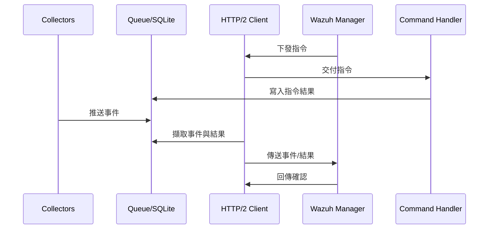
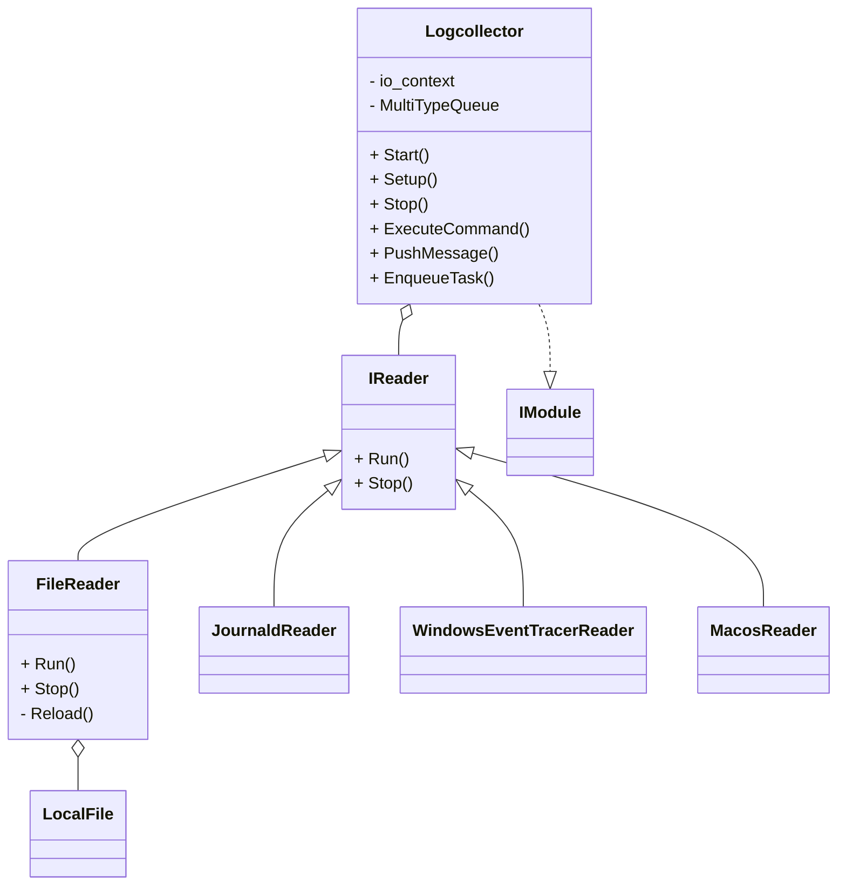

# Wazuh Agent 架構與元件分析

## 核心元件概覽

Wazuh Agent 透過清楚分工的元件協作，達成安全事件的蒐集、緩衝與傳送。其核心元件如下：

- **Agent 核心**：包含 HTTP/2 Client、Queue 及 Command Handler。Client 與 Wazuh Manager 建立安全雙向連線；Queue 以 SQLite 為後端保存事件與指令；Command Handler 則負責執行從 Manager 下發的命令並寫回結果。【F:docs/ref/introduction/architecture.md†L5-L44】
- **Configuration Parser**：自 YAML 檔案或字串載入設定，提供其他模組查詢配置的能力。【F:docs/ref/introduction/architecture.md†L5-L32】
- **Task Manager**：建立與管理執行緒，安排模組化工作的排程與生命週期。【F:docs/ref/introduction/architecture.md†L5-L32】
- **Modules**：分為 Collectors 與 Executors。Collectors 進行日誌、檔案完整性、資安基線與資產清查等資料蒐集；Executors 處理升級、集中化配置與主動回應等操作。【F:docs/ref/introduction/architecture.md†L33-L44】
- **Dependencies**：SQLite 提供 Queue 與 Command Handler 的持久化儲存；HTTP Client 供 Client 建立安全連線。【F:docs/ref/introduction/architecture.md†L24-L32】
- **Server/Manager**：在伺服端接收 Agent 上傳的事件並發送遠端命令，是整體協調中心。【F:docs/ref/introduction/architecture.md†L5-L44】

## 工作流程說明

1. **設定載入與排程啟動**：Agent 啟動時，Configuration Parser 讀取 YAML 設定；Task Manager 依設定啟動對應的模組執行緒並安排排程工作。【F:docs/ref/introduction/architecture.md†L17-L32】
2. **資料蒐集**：Collectors（例如 Logcollector、FIM、SCA 與 Inventory）依排程或事件觸發蒐集資訊，並透過 Queue 推送事件資料。【F:docs/ref/introduction/architecture.md†L33-L44】
3. **命令執行與回饋**：Wazuh Manager 可下發指令，由 Client 取回並交給 Command Handler 執行；結果再放回 Queue 等待傳送。Executors 亦在此階段處理升級、主動回應等操作。【F:docs/ref/introduction/architecture.md†L5-L44】
4. **事件傳送**：Client 從 Queue 取出事件與命令結果，透過 HTTP/2 與 Manager 交換資料，Queue 以 SQLite 確保傳送前後的資料一致與持久化。【F:docs/ref/introduction/architecture.md†L5-L44】

## 模組延伸：Logcollector 範例

Logcollector 模組示範了 Collectors 的運作方式：

- **Logcollector 類別**：實作 IModule，維護多型佇列、設定載入、命令執行與訊息推送能力。【F:docs/ref/modules/logcollector/architecture.md†L5-L33】
- **Reader 階層**：透過 IReader 介面定義共同行為，並依平台與來源衍生如 FileReader、JournaldReader、WindowsEventTracerReader 與 MacosReader 等讀取器。【F:docs/ref/modules/logcollector/architecture.md†L15-L44】
- **LocalFile**：提供 FileReader 使用的檔案來源抽象，支援多路徑與輪詢策略。【F:docs/ref/modules/logcollector/architecture.md†L17-L36】

上述設計讓 Logcollector 能跨平台整合多種事件來源，並統一將資料送入 Queue，與其他模組共享一致流程。

