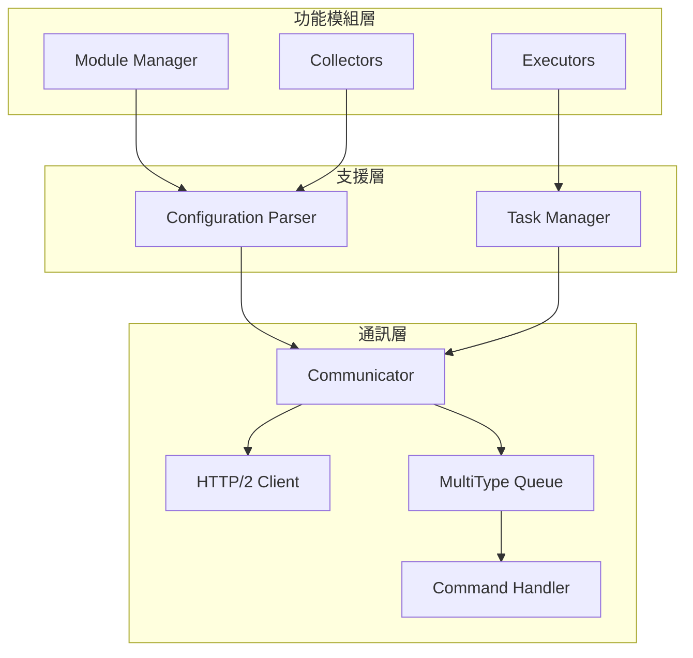
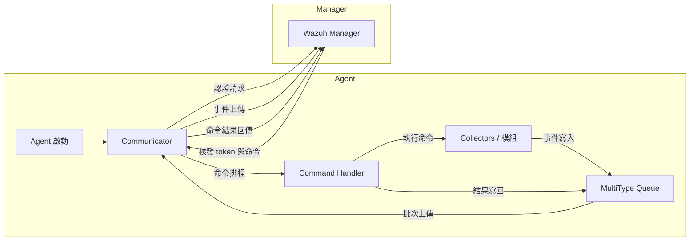

# Wazuh Agent 架構重點

Wazuh Agent 採模組化設計，核心通訊、支援服務與功能模組三層協同運作，以維持與 Wazuh Manager 的長連線、可靠命令執行與事件回傳。【F:docs/ref/introduction/architecture.md†L1-L178】【F:src/agent/src/agent.cpp†L134-L220】

## 架構分層

| 層級 | 主要元件 | 職責重點 |
| --- | --- | --- |
| 通訊層 | Communicator、HTTP/2 Client、MultiType Queue、Command Handler | 與 Manager 進行認證、命令輪詢與事件上傳；MultiType Queue 提供持久化緩衝，Command Handler 處理下行命令並回報結果。【F:docs/ref/introduction/architecture.md†L52-L177】【F:src/agent/communicator/src/communicator.cpp†L94-L355】【F:src/agent/multitype_queue/src/multitype_queue.cpp†L17-L210】【F:src/agent/command_handler/src/command_handler.cpp†L67-L168】 |
| 支援層 | Configuration Parser、Task Manager | 提供統一的 YAML 組態查詢與集中化設定合併；以 Boost.Asio 執行緒池與協程排程管理背景任務。【F:docs/ref/introduction/architecture.md†L52-L76】【F:src/agent/configuration_parser/src/configuration_parser.cpp†L20-L158】【F:src/agent/task_manager/src/task_manager.cpp†L16-L163】 |
| 功能模組層 | Module Manager、Collectors、Executors | Module Manager 註冊並啟動模組；Collectors 產生事件、Executors 處理主動命令或反應作業。【F:docs/ref/introduction/architecture.md†L68-L76】【F:src/modules/src/moduleManager.cpp†L39-L171】【F:src/modules/logcollector/src/logcollector.cpp†L24-L169】【F:src/modules/active_response/src/execd.c†L415-L520】 |

## 主要資料流

1. **認證與命令輪詢**：Agent 啟動後先發送認證請求，再透過 Communicator 的協程週期性輪詢命令、維持 token 與重新認證。【F:src/agent/src/agent.cpp†L134-L170】【F:src/agent/communicator/src/communicator.cpp†L102-L210】【F:src/agent/communicator/src/communicator.cpp†L295-L355】
2. **事件上傳**：Collectors 與其他模組把資料寫入 MultiType Queue；Communicator 的 Stateful/Stateless 任務批次擷取事件並送往 Manager。【F:src/modules/src/moduleManager.cpp†L39-L151】【F:src/modules/logcollector/src/logcollector.cpp†L135-L160】【F:src/agent/src/agent.cpp†L147-L170】
3. **命令處理**：取得的命令被推入 Queue，Command Handler 驗證後寫入 `command_store` 並呼叫對應模組或系統處理器；結果更新後再透過 Queue 回傳。【F:src/agent/src/agent.cpp†L141-L198】【F:src/agent/command_handler/src/command_handler.cpp†L91-L143】

## 韌性機制

* MultiType Queue 使用 SQLite 儲存三類訊息並控制背壓，確保重啟後事件與命令不遺失。【F:src/agent/multitype_queue/include/multitype_queue.hpp†L19-L123】【F:src/agent/multitype_queue/src/multitype_queue.cpp†L17-L210】
* Command Handler 在啟動時清理 `IN_PROGRESS` 命令並回報結果，維持至少一次執行語意。【F:src/agent/command_handler/src/command_handler.cpp†L145-L168】
* Configuration Parser 支援即時重載與共享設定合併，使集中化設定變更能安全套用。【F:src/agent/configuration_parser/src/configuration_parser.cpp†L97-L158】【F:src/agent/src/agent.cpp†L93-L206】
* Task Manager 集中管理協程與執行緒資源，當 Agent 停止時能依序關閉通訊、模組與命令處理，避免殘留背景工作。【F:src/agent/task_manager/src/task_manager.cpp†L16-L144】【F:src/agent/src/agent.cpp†L198-L220】

透過上述分層與保護機制，Agent 得以在變動的網路環境中維持穩定的資料採集與命令協作能力。
