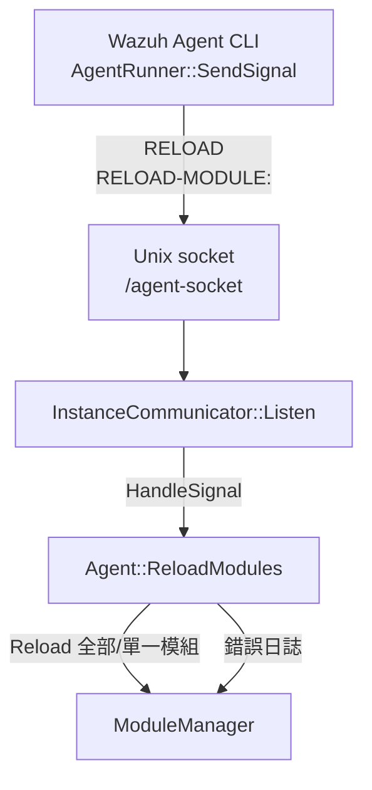

# Wazuh Agent 架構總覽

Wazuh Agent 以模組化的方式拆分為核心通訊、任務排程與功能模組三大層，確保事件蒐集、命令執行與設定同步能在不同執行緒與程序間協同完成。

## 摘要

- **核心通訊層**：Communicator 負責排程認證、命令抓取與事件上傳協程，HTTP/2 Client 則維持與 Wazuh Manager 的長連線並執行請求；MultiType Queue 緩衝事件，Command Handler 解析下行命令，四者構成 Agent 的資料平面。【F:docs/ref/introduction/architecture.md†L1-L80】【F:src/agent/src/agent.cpp†L134-L206】【F:src/agent/communicator/src/communicator.cpp†L102-L421】
- **支援服務層**：Configuration Parser 負責載入本地與集中化 YAML 組態；Task Manager 建立 Boost.Asio 執行緒池與協程排程，為所有背景工作提供生命週期管理。【F:docs/ref/introduction/architecture.md†L52-L76】【F:src/agent/configuration_parser/src/configuration_parser.cpp†L20-L158】【F:src/agent/task_manager/src/task_manager.cpp†L16-L165】
- **功能模組層**：Collectors 負責日誌、檔案完整性與資產掃描；Executors 處理主動回應與升級等命令，並回寫 Queue 與 Manager 溝通。【F:docs/ref/introduction/architecture.md†L68-L76】【F:src/modules/src/moduleManager.cpp†L39-L172】

## 元件一覽

| 類別 | 主要職責 | 關鍵檔案 |
| --- | --- | --- |
| HTTP/2 Client | 解析連線參數、建立 TLS 連線並讀寫 HTTP/2 請求/回應 | `src/agent/http_client/src/http_client.cpp`【F:src/agent/http_client/src/http_client.cpp†L81-L181】 |
| MultiType Queue | 以 SQLite 儲存 STATEFUL/STATELESS/COMMAND 訊息，支援同步與協程 API | `src/agent/multitype_queue/src/multitype_queue.cpp`【F:src/agent/multitype_queue/src/multitype_queue.cpp†L17-L224】 |
| Command Handler | 驗證、持久化並分派命令給模組或核心處理器 | `src/agent/command_handler/src/command_handler.cpp`【F:src/agent/command_handler/src/command_handler.cpp†L37-L142】 |
| Configuration Parser | 讀取本地/共享 YAML，提供型別安全與範圍驗證的查詢函式 | `src/agent/configuration_parser/*`【F:src/agent/configuration_parser/src/configuration_parser.cpp†L20-L158】【F:src/agent/configuration_parser/include/configuration_parser.hpp†L18-L237】 |
| Task Manager | 啟動執行緒池、託管協程並集中處理例外 | `src/agent/task_manager/*`【F:src/agent/task_manager/src/task_manager.cpp†L16-L165】 |
| Module Manager | 註冊 Collectors/Executors、套用設定與啟停模組 | `src/modules/src/moduleManager.cpp`【F:src/modules/src/moduleManager.cpp†L39-L171】 |

## 運行階段

1. **啟動與驗證**：Agent 建構時先確保 enrollment 資訊完整，載入 YAML 組態並設定集中化組態的群組查詢函式。【F:src/agent/src/agent.cpp†L21-L86】
2. **排程核心工作**：`Agent::Run` 啟動 Task Manager 執行緒池後，將認證輪詢、命令擷取與訊息上傳等協程排入待辦，並初始化功能模組。【F:src/agent/src/agent.cpp†L134-L188】
3. **模組運作**：Module Manager 依設定載入 Collectors（Logcollector、FIM、Inventory、SCA 等）與 Executors（Active Response、Agent Upgrade），將其任務推入 Queue 或回傳命令結果。【F:src/modules/src/moduleManager.cpp†L39-L172】
4. **關閉流程**：收到停止訊號後，Agent 順序停止 Command Handler、通訊器、模組與 Task Manager，確保協程與執行緒安全退出。【F:src/agent/src/agent.cpp†L200-L220】

## 資料交換流程

## 模組協調重點

- `ModuleManager::AddModules` 將平台啟用的模組註冊後執行 `Setup`，並透過 Task Manager 以非同步方式啟動，啟動過程會等待所有模組就緒或逾時。【F:src/modules/src/moduleManager.cpp†L39-L151】
- Collectors 透過 `m_pushMessage` 共享函式將事件寫入 MultiType Queue，Executors 在命令完成後亦將結果寫回 Queue 供 HTTP/2 Client 傳送。【F:src/modules/logcollector/src/logcollector.cpp†L135-L163】【F:src/modules/inventory/src/inventory.cpp†L110-L153】【F:src/modules/active_response/src/execd.c†L415-L498】
- 集中化組態變更時，`Agent::ReloadModules` 會重新載入 YAML 並熱重啟目標模組，確保新設定立即生效。【F:src/agent/src/agent.cpp†L93-L126】

## Instance Communicator / Local Control

- **IPC 通道與編碼**：`AgentRunner::SendSignal` 會根據組態內的 `path.run` 參數建立 `"<run path>/agent-socket"` Unix Domain Socket，訊息以純文字傳送並以換行字元結尾，配合 `InstanceCommunicator::Listen` 中的 `read` 例程使用 `\n` 作為訊息邊界。【F:src/agent/src/agent_runner_unix.cpp†L18-L43】【F:src/agent/instance_communicator/src/instance_communicator.cpp†L51-L88】
- **訊息格式與處理**：Instance Communicator 接收到 `RELOAD` 時會要求 `Agent::ReloadModules(std::nullopt)` 重載全部模組；若訊息為 `RELOAD-MODULE:<name>` 則解析出模組名稱並只重啟對應模組，其他未知訊息會記錄警告。【F:src/agent/instance_communicator/src/instance_communicator.cpp†L35-L46】【F:src/agent/src/agent.cpp†L93-L126】
- **錯誤處理與輪詢**：`Listen` 在失敗時記錄錯誤、關閉監聽器，並透過 1 秒的 `steady_timer` 等待後再次嘗試開啟，確保本地 CLI 短暫連線失敗時能自動恢復。【F:src/agent/instance_communicator/src/instance_communicator.cpp†L55-L118】
- **CLI 回饋**：CLI 的 `AgentRunner::ReloadModules` 若未提供模組名稱或 IPC 連線失敗會即時在終端印出錯誤並回傳非零值；`SendSignal` 將連線與寫入錯誤轉化為使用者可讀訊息，成功時則提示已送出重載指令。【F:src/agent/src/agent_runner.cpp†L216-L258】【F:src/agent/src/agent_runner_unix.cpp†L18-L43】
- **模組管理互動**：Reload 流程由 Instance Communicator 把訊號轉交給 Agent，`Agent::ReloadModules` 會鎖定重載流程、重新讀取設定檔並呼叫 `ModuleManager` 進行全域或單一模組的重啟作業；例外會被捕捉並記錄錯誤訊息。【F:src/agent/src/agent.cpp†L93-L126】
- **Restart Handler**：Command Handler 收到 `restart-handler` 模組命令時會呼叫 `RestartHandler::RestartAgent`，該函式會先判斷是否以服務形式執行，再根據平台呼叫 `systemctl` 或透過 `fork/execve` 重啟；執行結果以 `CommandExecutionResult` 回報，錯誤時會記錄日誌與傳回 `FAILURE` 狀態。【F:src/agent/src/agent.cpp†L168-L199】【F:src/agent/restart_handler/src/restart_handler.cpp†L1-L18】【F:src/agent/restart_handler/src/restart_handler_lin.cpp†L1-L20】【F:src/agent/restart_handler/src/restart_handler_unix.cpp†L1-L47】
- **IPC 抽象化建議**：若要支援多種 IPC 實作，可維持 `IInstanceCommunicator` 與 `IListenerWrapper` 做為核心介面，並新增「訊息序列化器」與「通道工廠」抽象層，讓 Unix Socket、命名管線或 gRPC 等後端能以相同生命週期管理進行替換；錯誤回報則統一以 `boost::system::error_code` 及例外整合到日誌訊息，並由 `CommandExecutionResult`/CLI 文字回覆給使用者，避免在核心流程中吞噬錯誤。【F:src/agent/instance_communicator/include/iinstance_communicator.hpp†L9-L29】【F:src/agent/instance_communicator/include/ilistener_wrapper.hpp†L9-L35】【F:src/agent/src/agent_runner_unix.cpp†L18-L43】【F:src/agent/restart_handler/src/restart_handler_lin.cpp†L1-L20】【F:src/agent/restart_handler/src/restart_handler_unix.cpp†L1-L47】

## 延伸閱讀

- [核心元件實作筆記](agent-core-core-components.md)
- [Communicator 協程與重試流程](agent-core-core-components.md#communicator)
- [功能模組與命令互動](functional-modules-collectors-executors.md)
- [支援服務模組細節](support-services-module.md)
